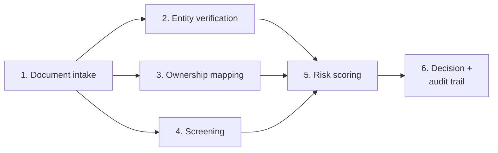
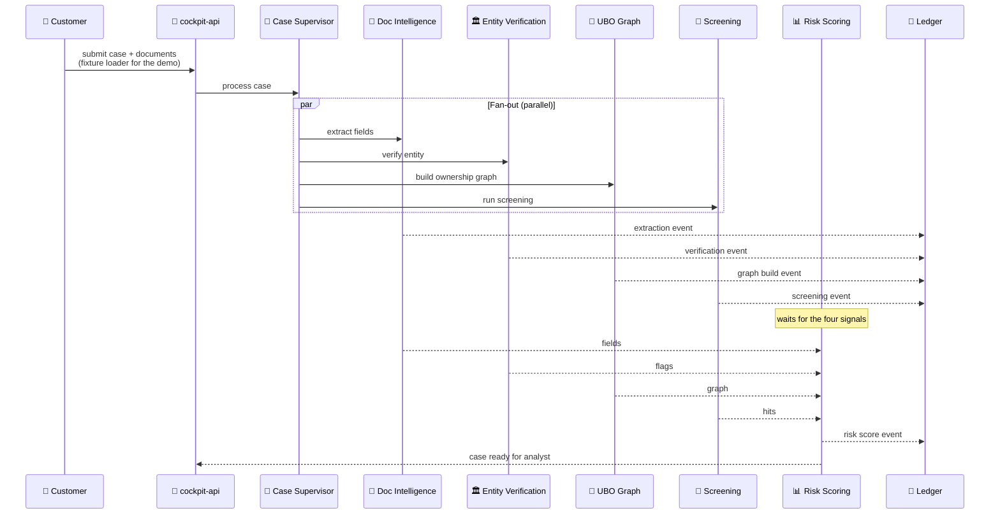
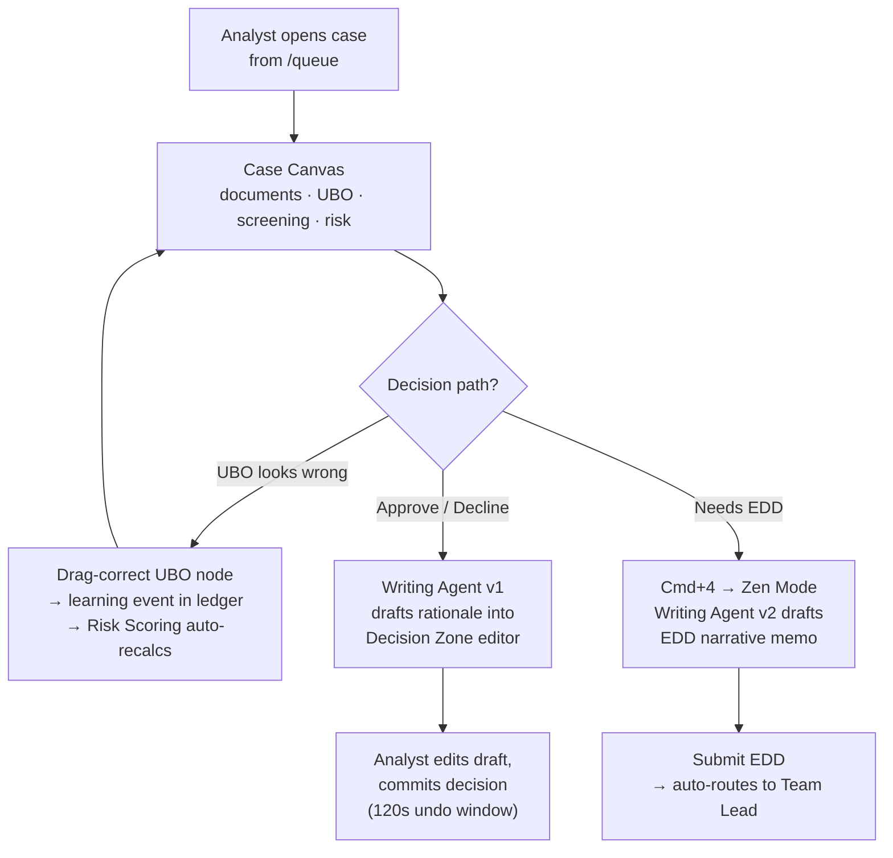
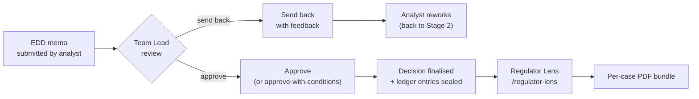

# KYC Cockpit — Project Overview

> A self-contained overview of the project: goals, use case, architecture, and current status. Deeper documents (architecture, epics, sprint status) are linked at the end.

---

## Executive summary

The **KYC Cockpit** is a working demo of a KYC analyst workstation built on IBM watsonx Orchestrate. The project has two objectives: build a usable application that handles SME onboarding end to end, and show that a full enterprise application can be assembled on the Orchestrate platform.

A mesh of nine specialist agents handles document extraction, entity verification, ownership mapping, sanctions screening, risk scoring, and decision drafting. Three personas — analyst, team lead, auditor — operate the workflow across three illustrative cases: a clean approval, an enhanced-due-diligence escalation, and a screening-hit adjudication.

The build was scoped as a short-cycle demo. It shows the platform's fit for multi-agent applications and surfaces the gaps to a production system. Document OCR, retrieval-augmented grounding, and full platform-level governance are flagged in [Next steps](#next-steps) for any follow-on build.

---

## Introduction

### Goals of this project

The project has two goals.

1. **Build a working KYC application.** The KYC Cockpit handles SME onboarding end-to-end: case intake, document extraction, ownership-graph construction, sanctions screening, risk scoring, decision authoring, and audit-trail export. Design constraints from the product brief: agents are visible in the UI rather than hidden behind forms; every data point in the case file is provenance-tagged to its source; decisions are reversible inside a 120-second undo window; and the interaction model is keyboard-first.

2. **Demonstrate the IBM watsonx Orchestrate platform.** All agents are authored with the watsonx Orchestrate Agent Development Kit (ADK) and run on cloud watsonx Orchestrate. The application surface — a React + TypeScript UI (`cockpit-ui`) and a FastAPI backend (`cockpit-api`) — runs locally and exposes its endpoints to cloud Orchestrate through an ngrok tunnel. The repository is a reference implementation for engineers evaluating Orchestrate for production application work.

### The use case we took — KYC

KYC — *Know Your Customer* — is the regulated process a bank runs before opening an account. The standard steps: verify the customer's identity, map who actually owns the entity (ultimate beneficial owners, or UBOs), screen the parties against sanctions, politically-exposed-person (PEP), and adverse-media lists, score the relationship's risk, decide whether to onboard, and produce an audit trail a regulator can reconstruct on demand.

**Demo scope.** This implementation covers **SME** (small-and-medium-enterprise) onboarding only. A single SME case touches most categories of agent work — document extraction, registry lookups, ownership-graph construction, screening-vendor integration, weighted-factor risk scoring, and natural-language drafting of the case decision. Retail onboarding, periodic refresh (pKYC), enhanced due diligence (EDD) memo drafting, and adverse-media investigation are scoped for later phases.

### Why KYC

KYC was selected as the demo domain for four reasons.

- **Operational stakes are large and measurable.** Financial institutions spend [**~$72.9M per year**](https://resources.fenergo.com/blogs/kyc-compliance-for-banks-addressing-the-cost) on KYC on average (Fenergo, 2025). [Global AML/KYC fines totalled **$10.4B in 2024**](https://complyadvantage.com/insights/the-biggest-aml-fines-in-2025/), including a single **$3.09B** penalty against TD Bank for systemic compliance failures.
- **Workflow breadth exercises an agent mesh.** [Forrester reports manual SME onboarding takes **2–34 weeks**](https://www.encompasscorporation.com/blog/reduce-end-to-end-onboarding-processing-times-by-32/). A single case combines document extraction, registry lookups, graph reasoning, vendor APIs, and human judgement — multiple agent specializations operating on one artefact.
- **The incumbent UX pattern is bolt-on.** Existing agent-driven KYC platforms (Fenergo, Moody's, IBM Consulting KYC-AI, Genpact) typically run agents behind form-based case-management UIs; agent-visible cockpits are not yet conventional in the category.
- **Provenance is mandatory, not optional.** Regulators ask *"where did this fact come from?"* and agent outputs must answer. The domain forces ledger discipline that would be optional in lower-stakes contexts.

For comparative context: published agentic-KYC deployments report **70–90%** productivity gains over manual baselines ([Sutherland Global](https://www.sutherlandglobal.com/insights/case-study/agentic-ai-kyc-refresh-70-percent-less-effort-50-percent-faster-reviews); [JPMorgan internal KYC engine, via McKinsey](https://www.mckinsey.com/capabilities/risk-and-resilience/our-insights/how-agentic-ai-can-change-the-way-banks-fight-financial-crime)).

---

## Introduction to KYC

An SME onboarding case moves through six phases — from the moment a customer submits documents to the moment the bank commits to onboard, decline, or escalate. The workflow is largely sequential: phase 1 produces the data the next three phases consume; phase 5 aggregates the four upstream signals into a risk band; phase 6 records the decision against that band.

| # | Phase | What happens |
|---|---|---|
| 1 | **Document intake** | Application documents (incorporation certificate, PAN, address proof, bank statements, director ID) arrive; identity, registration, and address fields are extracted. |
| 2 | **Entity verification** | The declared legal entity is cross-checked against official registries (e.g. MCA in India) — name, address, registration status. |
| 3 | **Ownership mapping** | The beneficial-ownership chain is reconstructed from declared shareholders, looking for nominee patterns and multi-layer foreign holdings. |
| 4 | **Screening** | Entity and connected individuals are checked against sanctions, politically-exposed-person (PEP), and adverse-media lists. |
| 5 | **Risk scoring** | Signals from phases 1–4 are combined into a risk band, with each contributing factor recorded so the score is auditable later. |
| 6 | **Decision + audit trail** | The bank commits to onboard, decline, or escalate to enhanced due diligence (EDD); the rationale and supporting evidence are recorded for regulatory reconstruction years later. |

---

## The Scene

### The three personas

Three personas drive the demo's interactions: an analyst who runs the cases, a team lead who approves escalations, and an auditor who reads the trail.

| Persona | Responsibilities | Needs | Pain points | What they like |
|---|---|---|---|---|
| **KYC Analyst** *(Kamal Singh)* | Investigates and decides on 8–12 onboarding cases per day; verifies identity, ownership, and screening hits; writes the rationale the bank stands behind. | A clear view of every signal that goes into a case decision; freedom to focus on judgement work rather than data wrangling; defensible records of every decision. | Swivel-chair across 4+ systems to assemble one case (KYC DB, core banking, screening platform, adverse-media tooling); re-typing the same context twice; audit findings surfacing months after the case closed. | Working fast without losing accuracy; honest visibility into where each fact came from; an undo path when they catch their own mistake. |
| **Team Lead** *(Rohan Mehta)* | Approves complex or high-risk decisions escalated by analysts; sends cases back when more work is needed; carries final accountability for the team's KYC quality. | One place with the full case context plus the analyst's reasoning trail; ability to attach conditions to an approval rather than a binary yes/no. | Approving outcomes when only the conclusion is visible, not the path that produced it; accountability without traceability. | Seeing the analyst's working, not just the verdict; structured decision options (approve-with-conditions, send-back-with-reason). |
| **Internal Auditor / Regulator** *(Anika Iyer)* | Reads, samples, and exports the bank's KYC decisions for internal compliance reviews and external regulatory inspections. | An end-to-end record of how each decision was reached — including which AI components contributed and what data they used; reproducibility years after the fact. | Exports that summarise away the actual decision logic; missing rationale for older cases; AI-driven steps that aren't logged at the same fidelity as human ones. | A timeline that captures every action — agent and human — in order; bit-exact reproducibility of the decision context. |

### The three cases

The demo runs three SME cases through the workflow above. Each is a different archetype, exercising a different path: a clean approval, an enhanced-due-diligence escalation, and a screening adjudication. All three cases load on `make seed` and reset between walkthroughs via `make demo-reset`.

| Case | Archetype | What the analyst does |
|---|---|---|
| **Shree Venkat Trading** | Clean SME — straightforward documents, single-layer ownership, no screening hits | **Happy path.** Confirms the extracted fields, accepts the verified entity, accepts the clean screening, commits an Approve decision. |
| **Vora Capital Holdings** | Multi-layered shell-UBO + recent incorporation | **EDD escalation.** Notices a nominee pattern in the ownership chain, corrects a misclassified node, accepts the elevated risk band, drafts an enhanced-due-diligence memo, routes to the Team Lead for sign-off. |
| **Ananya Iyer** | Individual customer with a synthetic screening hit | **Screening adjudication.** Reviews a sanctions name-match (subject vs. list-entry vs. score), adjudicates as false-positive with a structured reason, commits the decision. |

### Why this scene

The three cases together satisfy three design criteria.

1. **Match a typical KYC queue.** An SME queue at a mid-size bank contains a mix: routine approvals, complex-ownership cases that need escalation, and cases with screening hits to adjudicate. The three-case set reproduces that mix at a scale small enough to walk through end-to-end in a single demo session.

2. **Cover the three principal SME case patterns.** SME KYC casework breaks down into three dominant archetypes — clean-pass approvals, complex-ownership escalations, and screening-hit adjudications. Other variants (periodic refresh, retail customers, adverse-media-only flows) are subspecies of these or are scoped for later phases.

3. **Use every category of agent work.** Across the three cases the demo invokes document parsing, registry lookups, ownership reasoning, screening adjudication, risk scoring, narrative drafting, and human-in-the-loop approvals. The scenario set is sized so that each agent category is loaded by at least one case.

---

## The Solution

### What is built

The KYC Cockpit consists of three runtime components: a React + TypeScript single-page application (`cockpit-ui`), a FastAPI backend that holds case state and exposes tools to agents (`cockpit-api`), and a mesh of nine specialist agents authored with the watsonx Orchestrate Agent Development Kit (ADK) and running on cloud watsonx Orchestrate. The cloud agents reach back to the locally-running `cockpit-api` over an ngrok tunnel, and every agent action writes a provenance entry to the same append-only ledger that the audit timeline renders.

### The agent mesh

Nine agents make up the mesh, organised across five layers — orchestrator, intake, deep-dive, authoring, and conversational. The Case Supervisor routes; the other eight handle specific KYC work or conversational inquiry across the mesh.

| Agent | Capability | Persona benefit |
|---|---|---|
| **Case Supervisor** | Receives "process this case" calls; fans out to intake specialists in parallel; delegates ad-hoc per-document questions to Document Intelligence; lists cases on demand. | **Analyst** — one call triggers the parallel intake fan-out; no manual choreography across specialists. |
| **Document Intelligence** | Reads case PDFs and extracts typed KYC fields (CIN, GST, registered address, incorporation date, names) with a confidence band and a provenance pointer to the ledger. | **Analyst** — removes manual transcription from PDFs. **Auditor** — provenance pointer makes the source verifiable after the fact. |
| **Entity Verification** | Cross-references the declared entity against MCA registry data (mock adapter for the demo); surfaces name divergence, address discrepancy, and registration-status flags. | **Analyst** — registry mismatches are flagged automatically without a manual lookup step. |
| **UBO Graph** | Builds the beneficial-ownership graph from declared shareholders; surfaces nominee flags, shell-company heuristics, and multi-layer foreign chains. Output drives a force-directed canvas in the UI. | **Analyst** — ownership rendered visually rather than read out of spreadsheets; drag-corrections are recorded as learning events in the ledger. |
| **Screening** | Evaluates the entity and connected individuals against sanctions / PEP / adverse-media lists; returns hits with match score, name similarity, source list, and structured explanation (mock vendor adapter). | **Analyst** — each hit ships with a 3-column explainer (subject · list-entry · score breakdown) for adjudication. |
| **Risk Scoring** | Combines outputs from upstream agents into a structured risk score with per-factor decomposition (jurisdiction · UBO complexity · screening hits · document quality). Auto-recalculates when the analyst corrects an upstream input. | **Analyst** — risk score is decomposable per factor. **Auditor** — every contributing factor is attributable to its source signal. |
| **Writing Agent v1** | Drafts the analyst's decision rationale into the Decision Zone editor. Output is editable; analyst edits are tracked. Citations reference ledger IDs. | **Analyst** — rationale arrives as a draft to be edited rather than authored. **Lead** — every citation resolves to a ledger entry. |
| **Writing Agent v2 (EDD)** | Drafts a full Enhanced Due Diligence narrative memo for complex cases — structured sections (entity profile, UBO chain, risk factors, recommendation), every claim cited by ledger ID. Activated by Cmd+4 "Zen Mode". | **Analyst** — EDD memo arrives pre-structured rather than from a blank page. **Lead** — receives consistent structure across cases. |
| **Cockpit Chat** | Conversational interface with access to the full mesh state and current case context. Pattern: *mesh-as-tools* — invokes other agents as tools and surfaces their outputs in the conversation. | **Analyst** — ad-hoc inquiry across the mesh from a single conversational surface (e.g. "rerun screening with PEP only", "show MCA filings for this entity"). **Auditor** — same surface for retrospective audit queries. |

---

## How does all this work?

The full demo lifecycle splits into three blocks. **Stage 1** covers automated intake (workflow phases 1–5). **Stage 2** is the analyst's interactive review and decision (phase 6). **Stage 3** covers post-decision approval and audit. Cockpit Chat is available across the lifecycle and can be invoked at any point.

### Stage 1 — Case ingest and agent intake

A new case enters the cockpit and the agent mesh runs intake. The Case Supervisor receives the trigger and fans out four specialist agents in parallel (Document Intelligence, Entity Verification, UBO Graph, Screening). A fifth — Risk Scoring — runs once those four complete and combines their signals into a structured risk band. Each agent writes a provenance-stamped entry to the ledger as it finishes.

**Steps:**
1. The fixture loader (or, in production, an upload form) pushes a case into `cockpit-api` with its documents.
2. `cockpit-api` invokes the Case Supervisor through the cloud Orchestrate runtime.
3. The Case Supervisor fans out four specialists in parallel: Document Intelligence, Entity Verification, UBO Graph, Screening.
4. Each specialist writes one ledger entry as it completes its work.
5. Risk Scoring waits for the four upstream signals, computes a decomposed risk band, and writes its own ledger entry.
6. Case state transitions to *ready for analyst* and the case surfaces in the analyst's queue.

### Stage 2 — Analyst review and decision

The analyst opens the case from the queue and lands on the Case Canvas. Every agent's output is rendered inline with provenance pointers and confidence bands. The analyst reviews the outputs, corrects mistakes where needed, edits the agent-drafted rationale, and commits the decision. Most cases complete at this point and move to the audit lifecycle without escalation.

**Steps:**
1. The analyst opens a case from the queue and lands on the Case Canvas — every agent's output is laid out inline with confidence bands and ledger-pointer provenance.
2. If the ownership graph looks wrong, the analyst drag-corrects a node; the correction is recorded as a learning event in the ledger, and Risk Scoring re-runs against the corrected graph.
3. For a standard approve/decline, Writing Agent v1 drafts the decision rationale into the Decision Zone editor; the analyst edits and commits.
4. For an EDD case, the analyst presses Cmd+4 to enter Zen Mode; Writing Agent v2 drafts a structured EDD memo (entity profile, UBO chain, risk factors, recommendation).
5. Every commit opens a 120-second undo window. After the window closes the decision is final and ledger entries are sealed.
6. EDD submissions auto-route to the Team Lead's `/approvals` queue.

### Stage 3 — Lead approval and audit

EDD cases land with the Team Lead, who reviews the analyst's memo and the ledger trail, then either approves or sends the case back. Approved decisions — and standard cases that never went through EDD — flow into the audit lifecycle. The Internal Auditor / Regulator reads the same ledger via the Regulator Lens and can export per-case PDF bundles for external regulators.

**Steps:**
1. EDD cases arrive in the Team Lead's `/approvals` queue with the full ledger trail attached.
2. The Lead either approves the case (optionally with structured conditions written into the ledger) or sends it back to the analyst with feedback; sent-back cases re-enter Stage 2.
3. Approved decisions, and standard approve/decline cases that never went to EDD, finalise into the audit lifecycle.
4. The Internal Auditor / Regulator opens `/regulator-lens` and sees the full ledger timeline for any case — every agent action, every human decision, every learning event, in order.
5. Per-case PDF bundles are generated on demand for external regulatory submission.

---

## Project execution

Execution is structured around four planning documents and a status file. The planning documents describe the cockpit at full scope — the architecture, the product requirements, the epic and story decomposition, and the per-story specifications. The status file records which stories are `backlog`, `ready-for-dev`, `in-progress`, `review`, or `done` at any given point. The descriptive sections of this document (workflow, scene, solution, end-to-end process) describe the system as designed — the state in which every user story has been delivered.

### Important links

| Document | Path | What it covers |
|---|---|---|
| **Architecture** | [`planning-artifacts/architecture.md`](planning-artifacts/architecture.md) | End-to-end system design — runtime topology, component boundaries, data contracts, the agent runtime model (cloud Orchestrate ↔ ngrok ↔ cockpit-api), ledger schema, and non-functional requirements. |
| **PRD** | [`planning-artifacts/prd.md`](planning-artifacts/prd.md) | Product Requirements Document — functional and non-functional requirements, success metrics, user journeys, scope decisions, and acceptance criteria at the product level. |
| **Epics** | [`planning-artifacts/epics.md`](planning-artifacts/epics.md) | Epic and story decomposition with story-level acceptance criteria — 12 epics, ~70 user stories that together implement the PRD. |
| **User stories (status filter)** | [`implementation-artifacts/sprint-status.yaml`](implementation-artifacts/sprint-status.yaml) | Status of every user story in the backlog (`backlog` · `ready-for-dev` · `in-progress` · `review` · `done`). Per-story implementation specifications live alongside in [`implementation-artifacts/`](implementation-artifacts/). |

Other planning artefacts — product brief, UX design specification, sprint-change proposals, agent-inventory and flow — live in the same `planning-artifacts/` folder.

### Sprints

Each epic was scoped as a sprint. The table below summarises sprint scope and story count. Story-level breakdown and acceptance criteria live in [`epics.md`](planning-artifacts/epics.md).

| # | Name | Scope | Stories |
|---|---|---|---|
| 1 | **Foundations & Cockpit Shell** | Polyglot monorepo bootstrap, one-command dev environment, CI/CD skeleton, cockpit shell with user-switcher, clone-to-running-demo target. | 6 |
| 2 | **Case Ingest & Lifecycle** | Case schema and state machine, GET case retrieval API, queue-rail rendering with basic ordering, fixture loader for the three seeded cases. | 4 |
| 3 | **First Agent & Audit Log** | Append-only ledger, agent-action decorator, Pydantic provenance contracts, Document Intelligence agent, Case Supervisor fan-out, documents panel with provenance pills, confidence pill component, document upload with real PDF processing. | 8 |
| 4 | **Triage Mode & Live Mesh Visibility** | Risk × SLA queue ordering, keyboard triage loop, agent face SVGs with state machine, motion utilities, Agent Copilot pane with live activity feed, SSE stream endpoint, mode switcher, command palette, agent-state pills. | 9 |
| 5 | **Entity & UBO Investigation** | Entity Verification agent + mock MCA tool, UBO Graph agent, UBO canvas component, drag-correct interaction with learning event, Risk Scoring agent + decomposition bar, auto-recalc on officer correction, UBO and risk panels on case canvas. | 9 |
| 6 | **Screening, Reasoning Traces & Cockpit Chat** | Screening adapter + agent, 3-column screening explainer, reasoning-trace contract enforcement, GET reasoning-trace endpoint, reasoning-trace slide-out, Cockpit Chat agent (mesh-as-tools), conversational UI in the agent copilot pane. | 8 |
| 7 | **Decision Authoring** | Decision Zone with Tiptap editor, tonal typographic shift on focus, Writing Agent v1 (rationale draft), 120-second undo timer, undo pill with countdown, seal animation on commit, POST-decision endpoint, read-only evidence shelf, structured decision outcomes. | 9 |
| 8 | **Zen Mode & EDD Memo Drafting** | Cmd+4 mode switch to Zen, Zen-mode visual treatment, Writing Agent v2 (EDD drafter), citation enforcement by ledger ID, evidence shelf with attachment ingest, SHA-256 hashed attachments, EDD-outcome auto-enqueue for Lead approval. | 7 |
| 9 | **Audit Trail, Regulator Lens & Export** | Audit-trail timeline component, Regulator Lens read-only mode, PDF export bundle assembly. | 3 |
| 10 | **Multi-Role (Lead Approvals)** | Team Lead approval queue route, approve-with-conditions structured state in the ledger, lead-approval log entry. | 3 |
| 12 | **Cockpit Visual Refresh** | Full-viewport shell with design tokens, chrome, mode switcher; Queue Rail and Case Canvas information architecture; documents and risk panel rebuild; agent-activity strip and UBO refresh; decision drawer and role-route scaffolds. | 5 |

Epic 11 (Pilot Hardening — pentest, DR rehearsal, WCAG audit, performance budgets, India jurisdiction lockdown) was removed from demo scope on 2026-04-29; rationale is recorded in [`sprint-change-proposal-2026-04-29.md`](planning-artifacts/sprint-change-proposal-2026-04-29.md).

---

## Next steps

This repository was built as a short-term demonstration of what can be assembled on the IBM watsonx Orchestrate platform. The current build is a working demo, not a production system. Several capabilities from the original product brief were intentionally simplified or deferred to ship the demo within a constrained timeline. Taking the project from demo to a production-ready KYC application would require a further build cycle covering the items below.

### Recommended enhancements

Two near-term enhancements would meaningfully strengthen the demo before broader use.

1. **Proper OCR for document intake.** Today's Document Intelligence agent runs LLM-based extraction against PDF text. A production deployment would need a dedicated OCR / document-AI pipeline (IBM Document AI, Watson Discovery, or equivalent) covering scanned PDFs, image-only documents, multilingual text, and table extraction with consistent confidence calibration.
2. **Richer search tools and a more capable Cockpit Chat.** The current Cockpit Chat invokes mesh agents as tools but its retrieval surface is narrow. Useful additions for production use: full-text search across the case corpus, structured search across the ledger, retrieval-augmented grounding against regulatory policies (e.g. RBI Master Direction on KYC, FATF guidance), and case-to-case similarity search for analyst inquiry.

### Deferred from MVP scope

The 2026-04-29 re-scope cut the following capabilities to focus on the local demo. Each item remains documented in [`sprint-change-proposal-2026-04-29.md`](planning-artifacts/sprint-change-proposal-2026-04-29.md) for revival.

| Capability | What it adds |
|---|---|
| **OIDC / SAML SSO** | Replaces the user-switcher dropdown with a real identity provider; needed for any deployment beyond a single demo machine. |
| **Multi-tenant isolation** | `tenant_id` enforcement at every data boundary; required for any shared deployment. |
| **Cryptographic audit ledger** | HSM-backed Ed25519 signing with hash-chain continuity; replaces the simple JSON append-only log. |
| **Offline ledger verifier CLI** | Standalone binary that reads an exported bundle and proves chain integrity without server access. |
| **Real screening vendors** | ComplyAdvantage / LSEG / Dow Jones / ABBYY adapters in place of the mock vendor used today. |
| **Real Document AI integration** | IBM Document AI or Watson Discovery in place of the LLM-on-PDF-text shortcut (covered above under Recommended enhancements). |
| **Multi-cloud adapter conformance suites** | Test harness that exercises every screening / Doc AI vendor through a single contract surface. |
| **Audit export bundle with hash chain** | Signed bundle with offline-verifiable hash chain to accompany the PDF export (today: PDF only). |
| **CCO Portfolio Dashboard** | Senior-stakeholder view of caseload, throughput, and aggregate risk across the bank. |
| **Pre-pilot hardening (Epic 11)** | Pentest, DR rehearsal, WCAG 2.2 AA third-party audit, performance budget verification, confidence calibration study, India jurisdiction-pack lockdown. |

Beyond MVP, the original product brief also envisioned retail onboarding, perpetual KYC (pKYC) refresh, EDD/SAR for multiple jurisdictions, a mobile companion, and collaborative multi-user cursors — all explicit V2 territory.

---

## The findings

The KYC Cockpit was built end-to-end on IBM watsonx Orchestrate. Each row of the table below names a platform capability used in the demo, the value it provided, and where it shows up in the codebase.

| Feature | So what? | How it was used in this demo |
|---|---|---|
| **Agent Development Kit (ADK)** — Python SDK + `orchestrate` CLI for declarative agent authoring (`agent.yaml`, `@tool` decorators, OpenAPI imports). | Declarative authoring lets a team stand up multiple agents in days rather than weeks — each agent is a config file plus a Python function, not a service. For multi-agent applications scaling from 1 agent to 10, this is the difference between 10 config files and 10 microservices. Adding a new agent is dropping a directory under the registry. | All nine agents in the demo are authored via ADK. `make adk-register` walks `apps/agents/src/agents/registry/*` and imports each agent and its OpenAPI spec to the cloud tenant; no per-agent registration scripts to maintain. |
| **Multi-agent orchestration (supervisor + collaborators)** — agent-as-tool topology where one agent invokes others directly through the runtime. | Multi-agent application logic — supervisors delegating to specialists, agents invoking each other — is expressed in YAML rather than orchestration code. Bespoke orchestration glue is typically the most brittle layer of an agent system; the ADK collaborator pattern replaces it with declarative routing, which is what makes mesh-style applications shippable on a normal product timeline. | The Case Supervisor delegates ad-hoc per-document questions to Document Intelligence; the same pattern lets Cockpit Chat invoke any of the eight specialists as tools — no bespoke routing layer. |
| **Tool registration via OpenAPI** — any HTTP service with an OpenAPI spec becomes an agent tool. | Any existing back-end — REST API, microservice, legacy system fronted by an HTTP wrapper — becomes agent-callable by registering its OpenAPI spec. For enterprises with substantial existing infrastructure, this is the lowest-friction way to add agentic features over what is already built: agents see contracts, not implementations, and the implementation language is irrelevant. | The `cockpit-api` FastAPI routers expose `extract_document_fields`, `run_case_intake`, `list_cases`, `screening_lookup`, and others as OpenAPI; `make adk-spec` regenerates the specs; agents call them through the ngrok tunnel without knowing where the tool runs. |
| **LLM-agnostic agent definition** — model is a per-agent config field, not a code dependency. | Model swaps are a config change, not a code migration. LLM availability shifts constantly — deprecations, new releases, regional variants — and per-agent decoupling keeps application code stable through that churn. Different agents in the same mesh can also use different models tuned to their work (a small fast model for classification, a larger model for narrative drafting). | The demo currently uses `groq/openai/gpt-oss-120b` because Granite 3.2 8b was deprecated mid-trial. Each agent's model is declared in its `agent.yaml`; the audit ledger records `model_id` per call so model swaps remain traceable downstream. |
| **Cloud-hosted runtime** — agents run on the IBM cloud tenant, not locally. | No agent runtime to operate. Runtime upgrades, scaling, multi-region availability, and security patching are the platform's concern. For teams shipping agentic applications this means the application team is freed from running the agent platform — they ship features instead of operating LLM inference infrastructure. | The cockpit's UI, API, and SQLite database run on the developer's laptop; agents run in the cloud and reach back via an ngrok tunnel. The cockpit codebase holds zero LLM credentials. |
| **Mesh-as-tools conversational pattern** — a chat agent with the rest of the agent mesh wrapped as its tools. | A single conversational agent can expose an entire agent mesh as its toolbox — end users query the mesh through one channel without bespoke per-question routing in the application. This is the pattern that lets multi-agent applications offer a chat interface without building a chat-orchestration layer from scratch. | Cockpit Chat (Epic 6) exposes `extract_document_fields`, `run_case_intake`, screening lookups, and case state as tools; the chat LLM decides which to invoke from the analyst's prompt. |
| **Knowledge grounding (RAG)** — knowledge bases and retrieval-augmented generation against ingested documents. | Domain-heavy applications (compliance, legal, medical, regulated finance) need agents that ground responses in source material rather than LLM training data alone. RAG is the difference between agents that hallucinate and agents that cite; in regulated workflows it is also the foundation of citation traceability. | **Not used in this demo.** Agents reason from case state passed via tools. Production KYC use would ground the Writing and Screening agents against regulatory documents (RBI Master Direction on KYC, FATF guidance) — listed as a deferred capability under [Next steps](#next-steps). |
| **Agent governance and observability** — platform-level traces stamping every agent call with model, prompt context, latency, and response. | Multi-agent applications fail in subtle ways (wrong tool selected, wrong model invoked, silent hallucinations) and platform-level observability is what catches them. For regulated workflows it is also the foundation of the audit trail; without it, every team rebuilds bespoke logging and ends up with patchy coverage. | **Partially used.** The platform's native trace logs are available in the cloud tenant. The demo's audit story is carried by a custom append-only JSON ledger written by the agent-action decorator (`apps/agents/src/agents/supervisor/action_decorator.py`), which stamps `model_id`, prompt context, confidence band, and timestamp per call. Production deployment would compose both layers — platform traces for engineering observability, the ledger for regulatory audit. |
