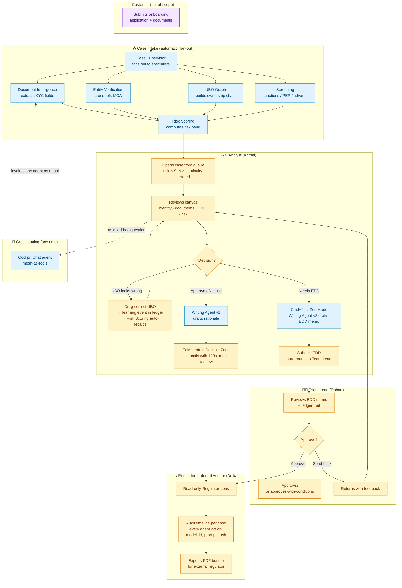

# Agent Inventory & KYC Flow

**Last updated:** 2026-05-07
**Status:** Reference document (not a spec)
**Audience:** POC evaluators, IBM stakeholders, anyone joining the project mid-flight
**Source documents:** `epics.md`, `architecture.md`, `prd.md`, `ux-design-specification.md`

This document answers two questions:

1. **What agents are we building, and what does each one do?**
2. **Where do humans and agents collaborate across the KYC lifecycle?**

It's a single-page orientation. For binding requirements see the source documents above; for current implementation status see `Documentation/implementation-artifacts/sprint-status.yaml`.

---

## Agent inventory (8 agents across 5 epics)

| # | Agent | Epic | Status (2026-05-07) | LLM (today) | Tools | Responsibility |
|---|---|---|---|---|---|---|
| 1 | **Case Supervisor** | 3.5 | ✅ Implemented + deployed to hosted Orchestrate trial | `groq/openai/gpt-oss-120b` | `run_case_intake`, `list_cases` | Orchestrator. Routes "process this case" to the deterministic intake fan-out; delegates ad-hoc per-document questions to Document Intelligence; lists cases on demand. Hybrid pattern: ADK collaborator routing + a deterministic Python orchestrator behind a tool. |
| 2 | **Document Intelligence** | 3.4 | ✅ Implemented + deployed | `groq/openai/gpt-oss-120b` | `extract_document_fields` | Reads case PDFs (incorporation cert, PAN, Aadhaar, bank statements, etc.) and extracts KYC fields (CIN, GST, registered address, incorporation date, names) with confidence band + provenance pointing to the audit ledger. |
| 3 | **Entity Verification** | 5.1 | 📋 Planned | TBD | `mca_lookup` (mock) | Cross-references the case entity against MCA (and originally GST) to surface mismatches: name divergence, address discrepancy, registration status. The MCA tool returns fixture data shaped like real MCA responses for the demo. |
| 4 | **UBO Graph** | 5.3 | 📋 Planned | TBD | (uses Document Intelligence outputs as input) | Builds the beneficial-ownership graph from declared shareholders + corporate structure. Surfaces nominee flags, shell-company heuristics, multi-layer foreign ownership chains. Output drives the force-directed `UBOCanvas` UI component. |
| 5 | **Risk Scoring** | 5.6 | 📋 Planned | TBD | (consumes outputs of Document Intelligence, Entity Verification, UBO Graph, Screening) | Computes a structured risk score with decomposition (jurisdiction, UBO complexity, screening hits, document quality). Auto-recalculates when an officer drag-corrects the UBO graph. Output drives `RiskScoreBar` with hover decomposition. |
| 6 | **Screening** | 6.2 | 📋 Planned | TBD | `screening_lookup` (mock vendor adapter) | Evaluates case entity + associated individuals against sanctions, PEP, adverse-media lists. Returns hits with match score, name similarity, source list, and structured explanation. Demo uses a mock adapter; production swaps in a real vendor (e.g. ComplyAdvantage). |
| 7 | **Writing Agent v1** | 7.3 | 📋 Planned | TBD | (consumes ledger entries + screening explainer + risk decomposition) | Drafts the analyst's decision rationale in the `DecisionZone` (Tiptap editor). Output is editable; analyst's edits are tracked. Citations reference ledger IDs. |
| 8 | **Writing Agent v2 (EDD)** | 8.3 | 📋 Planned | TBD | (same as v1 + evidence shelf attachments) | Drafts a full Enhanced Due Diligence narrative memo for complex/escalated cases — structured sections (entity profile, UBO chain, risk factors, recommendation), every claim cited by ledger ID. Activated by Cmd+4 "Zen Mode". |
| 9 | **Cockpit Chat** | 6.7 | 📋 Planned | TBD | All other agents wrapped as tools | Conversational interface with access to the full mesh state and current case context. Pattern: "mesh-as-tools" — the chat agent invokes other agents by calling them as tools, surfacing their outputs in the conversation. |

**Notes:**
- LLM choice for planned agents will be revisited per-agent in their respective stories. Today's pin to `gpt-oss-120b` for the two implemented agents was driven by IBM's trial Orchestrate model availability (Granite 3.2 8b deprecated mid-trial). Agent reasoning model is independent of platform — the audit ledger stamps `model_id` per call.
- All planned agents follow the same pattern as Document Intelligence: real ADK agent registration, real Pydantic-contracted tools, agent action recorded in the append-only JSON ledger.

---

## Human roles (3 personas)

The cockpit demo runs with three hardcoded personas (real auth deferred — see Story 1.4 + 1.6 for details).

| Persona | UUID (fixture) | Routes accessible | Responsibilities |
|---|---|---|---|
| **KYC Analyst** — Kamal Singh | `dc2aaaa3-555b-4636-89d0-6047dc205220` | `/queue`, case canvas, decision zone | Primary user. Reviews case canvas after agent intake completes; drag-corrects UBO graph; commits decisions (approve / decline / EDD). |
| **Team Lead** — Rohan Mehta | `a725a9bb-5b8e-4984-8d23-19c682225002` | `/approvals` | Approves complex decisions queued by analysts. Can approve-with-conditions (structured state in ledger). |
| **Internal Auditor / Regulator** — Anika Iyer | `a1582a20-62e1-497b-910c-45c0b0ee7030` | `/regulator-lens` | Read-only audit view. Sees the full audit ledger timeline, can export PDF bundles per case. |

---

## End-to-end KYC flow (where agents and people meet)

**Reading the diagram:**
- **Blue boxes** = agents (autonomous; their actions are stamped in the ledger with `model_id`, prompt hash, confidence)
- **Amber boxes** = human decisions and reviews
- **Purple box** = customer (out of scope for this demo — case fixtures stand in)
- **Solid arrows** = primary lifecycle flow
- **Dashed arrows** = on-demand conversational interactions (Cockpit Chat can invoke any agent at any point)

---

## What's load-bearing for the IBM POC narrative

This flow is the proof point for **all eight watsonx Orchestrate sales claims** we mapped earlier:

1. **Automate complex business processes** → the parallel intake fan-out (5 specialist agents in one fan-out call) is exactly that
2. **Coordinate teams of specialised AI agents** → Case Supervisor + 7 specialists + Cockpit Chat = textbook multi-agent topology
3. **Full audit and governance** → every transition point in the diagram writes to the append-only ledger; Regulator Lens (Anika's view) renders that ledger directly
4. **Use any LLM** → today's `groq/openai/gpt-oss-120b` works; switching to Granite is a one-line agent.yaml change per agent
5. **Plug into existing systems** → MCA / GST / screening vendor / document storage all enter as tools registered via OpenAPI specs
6. **Humans firmly in control** → analysts review, drag-correct, edit drafts; team leads approve; regulators audit. Agents propose; humans decide.
7. **Knowledge grounding** *(parked for v2)* → planned: a "regulator policies" knowledge base (RBI Master Direction on KYC, FATF guidance) the Screening and Writing agents would ground against. See conversation notes from 2026-05-06 working session.
8. **Multi-channel deployment** *(out of scope)* → custom cockpit UI is the channel; not exercising Slack/Teams in this POC.

---

## Reference

- **Architecture:** `Documentation/planning-artifacts/architecture.md`
- **Epics + stories:** `Documentation/planning-artifacts/epics.md`
- **Functional requirements** for each agent: `epics.md` § Functional Requirements (FR8, FR11, FR15, FR17, FR18, FR23, FR26, FR28, FR55)
- **Demo scope re-scope:** `Documentation/planning-artifacts/sprint-change-proposal-2026-04-29.md`
- **Current sprint status:** `Documentation/implementation-artifacts/sprint-status.yaml`
- **Implementation status today:** Story 1.6 ready-for-dev (IdentityProvider seam); Epic 3 entirely shipped to hosted Orchestrate trial via `make adk-register` (2026-05-07)
