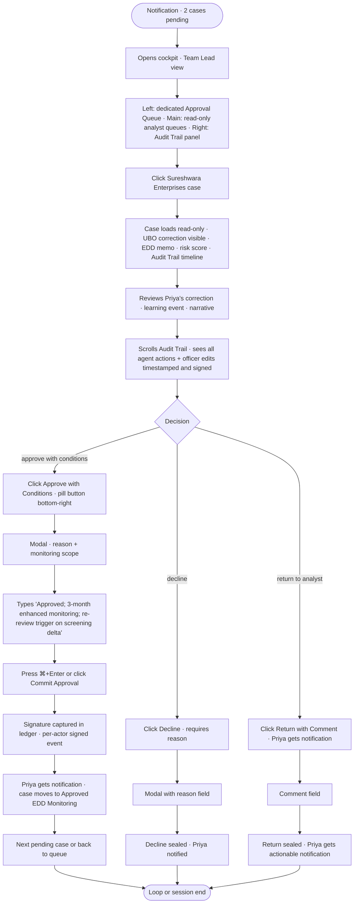
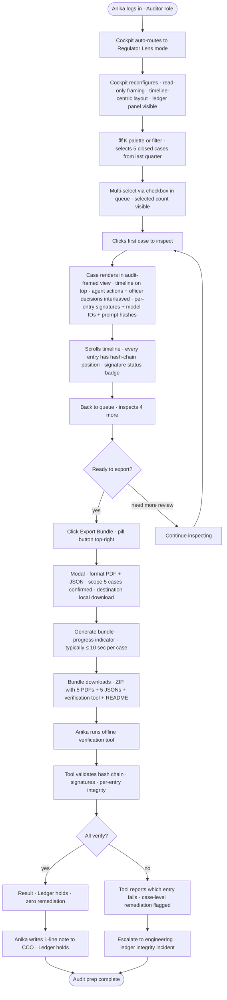

---
stepsCompleted:
  - step-01-init
  - step-02-discovery
  - step-03-core-experience
  - step-04-emotional-response
  - step-05-inspiration
  - step-06-design-system
  - step-07-defining-experience
  - step-08-visual-foundation
  - step-09-design-directions
  - step-10-user-journeys
  - step-11-component-strategy
  - step-12-ux-patterns
  - step-13-responsive-accessibility
  - step-14-complete
workflow_completed: true
completion_date: 2026-04-24
supportingArtifacts:
  - Documentation/planning-artifacts/ux-design-directions.html
  - Documentation/planning-artifacts/ux-mockups.html
inputDocuments:
  - Documentation/planning-artifacts/prd.md
  - Documentation/brainstorming/brainstorming-session-2026-04-24-0130.md
---

# UX Design Specification - KYC Cockpit

**Author:** Kamal
**Date:** 2026-04-24

---

## Executive Summary

### Project Vision

KYC Cockpit is a deliberate market inversion. Every shipping agentic-KYC platform — Fenergo, Moody's, IBM Consulting KYC-AI, Genpact, Fulcrum, Lyzr, Akira — bolts agents onto 2015-era case-management forms. Officers get faster clerical work; they don't get agency. KYC Cockpit flips the stack: **the agent mesh is the product, the cockpit is the moat**. A purpose-built analyst workspace where mesh activity is legible in real time, every datum is provenance-tagged, every decision is sacred, and the officer feels senior — not clerical. A 12–18 month whitespace window before an incumbent counter-moves. Speed and design-as-DNA are the mitigations.

**The UX is the moat.** Seven design principles thread through every decision: agent work is visible (not hidden), every datum is provenance-tagged, decisions are sacred, keyboard beats clicks, density gradient (not uniform density), confidence is visual (not textual), officer cognitive design is first-class. If a feature violates any, it does not ship.

**Visual vision — "marble and spring flowers."** Light, minimal, mostly white with confident black structural marks — and color used sparingly, deliberately, like a few spring flowers strewn across a slab of veined marble. Not an IBM Carbon product. Not a heavy enterprise product. Typography is the core structural element — clean, hierarchical, load-bearing. The interface responds dynamically to interaction — sections *breathe* when engaged, not with animation theater, but with measured motion that signals "we heard you." No jank. No stacked modals. No tabbed form whiplash. Spatial continuity over navigation gymnastics.

**Emotional arc we are designing for:**

1. **"Everything is so beautifully organised here."** Zero-second impression — the cockpit *reads* as a cockpit. The six-zone architecture is visually apparent before a single click.
2. **"Oh — I can actually see what it's thinking."** First reasoning-trace slide-out reveals the agent's search, hit, confidence, and counterfactual.
3. **"I didn't write from a blank page."** First edit-don't-author decision commit — agent drafted 80%, officer edited two sentences.
4. **"The trail is unimpeachable."** First Regulator Lens export — mock audit returns zero remediation.
5. **"I got my Friday back."** *(Future — pKYC silent auto-close.)*

### Target Users

**Primary — MVP (four human roles + one machine consumer):**

| Persona | Role | UX relationship |
|---------|------|-----------------|
| **Priya** | KYC Analyst, 28, 3 years experience, 8–12 cases/day | Lives in the cockpit all day. Fluent keyboard-first (j/k/x/d, ⌘K, ⌘+1–6). Wants agency, reasoning trails, and to feel senior. Represents ~70% of KYC workforce. |
| **Rohan** | Team Lead | Dedicated approval queue; read-only access to analyst cases. ~2 approval decisions per sitting. Needs rapid context-scan density and full audit-trail legibility. |
| **Meera** | Chief Compliance Officer (buyer) | Weekly Portfolio Dashboard check. Needs board-ready summaries, cohort drill-down, and a Regulator Readiness indicator that tells her in one glance: "the ledger holds." |
| **Anika** | Internal Auditor | Regulator Lens mode — reframes cockpit into read-only audit view. PDF + JSON export with offline-verifiable hash chain. |
| **Core Banking System** | API consumer | No UI. REST case-ingest + webhook decision callbacks. State-machine contract is the interface. |

**Hidden secondary audience (Path B — internal architectural intent, not in the bank-buyer promise):** solution architects and developers evaluating the codebase as a reference implementation of IBM watsonx Orchestrate + ADK patterns. The cockpit must earn an "I didn't know Orchestrate could do this" reaction. The visible UX is part of that pitch, not separate from it.

### Key Design Challenges

1. **Making an agent mesh legible without cognitive overload.** Fourteen agents (eight in MVP) working in parallel on a single case — officers must see *what's happening* without drowning in it. Status pills, live activity feed, reasoning-trace slide-outs all must cohere into a single comprehensible stream.
2. **Honoring the density gradient.** Dense cockpit (triage, investigation) → calm Decision Zone → zen SAR/EDD Writing mode. Same underlying case data, radically different UI footprints. Switching must feel instant and spatially coherent — not disorienting.
3. **Architectural legibility as the first-demo impression.** In the first three minutes of a demo, a viewer must be able to *read* the cockpit — "that's the queue, that's the canvas, that's the agent pane, that's where decisions happen." Information architecture is the first moment of delight.
4. **Defeating "death by form."** The universal failure mode of incumbent KYC tooling: tabbed forms, mandatory-field submit errors, state loss, context evaporation between views. Spatial continuity is our explicit counter-move — the case is a canvas, not a multi-page wizard.
5. **Four-tier confidence-banded visual system as a true design primitive.** Must work across pills, graph edges, score bars, screening hits, decision recommendations — via **shape, position, and label, not just color** (WCAG 2.2 AA + 8% color-blindness constraint). Feels refined, not gimmicky. Any new feature declares its confidence treatment before implementation.
6. **Keyboard-first while concurrently screen-reader-accessible.** `j/k/x/d` triage loop, ⌘K command palette, ⌘+1–⌘+6 mode switch — all must be primary paths *and* fully accessible. These are not in tension if designed from day one; they are in tension if bolted on later.
7. **Dynamic motion that feels alive but not theatrical.** When Priya clicks, sections respond — expand, focus, reveal — with measured, purposeful motion. Not Lottie animations. Not jank. Banking officers will reject anything that feels "gimmicky" or slows them down.
8. **Designing a visual language that is *distinctly not Carbon and not legacy-bank*.** Marble + spring flowers is the north star: light, typographic, confident, occasional color. Must feel ownable and fresh without drifting into "consumer app" territory that a CCO would dismiss.

### Design Opportunities

1. **Signature visual language — "marble and spring flowers."** Light, typographic, minimally-chromed, with rare and deliberate color. No compliance tool looks like this today. This alone can carry brand recognition.
2. **Typography as structure.** Rare in enterprise compliance tooling — which defaults to dense chrome and form-heavy layouts. A typographic-first hierarchy positions the product as *serious but modern*. Hints: Medium · Stripe docs · Linear · Apple's pro apps.
3. **Four-tier confidence-banded system as design DNA.** If we nail this primitive once, every future feature has a clear treatment — officers learn the grammar once and read any new agent output fluently.
4. **Reasoning-trace slide-out as the signature interaction.** The moment the demo hinges on — the "oh, I can see what it's thinking" revelation. An opportunity to invent a new interaction pattern the industry doesn't have.
5. **Six-mode cockpit with density gradient.** No shipping KYC platform offers modes. Same case data, radically different UIs per task (triage · investigate · decide · write · audit · learn). Figma's design-vs-prototype is the closest analog.
6. **Drag-correct-and-teach on UBO Canvas.** Spatial manipulation as an officer-agent feedback loop — the officer drags an edge, the agent asks permission to learn. Production-grade human-in-the-loop without RLHF baggage.
7. **"What would change your mind?" counterfactual reasoning.** Every agent output exposes not just *what* it concluded but *what would flip the conclusion*. Novel interaction pattern with no shipping competitor.
8. **Regulator Lens mode + offline-verifiable ledger.** The auditor's UI as a first-class mode (not an afterthought export). Every other tool treats audit as a log-dump; we treat it as a designed experience with cryptographic teeth.

## Core User Experience

### Defining Experience

The single interaction that, if we nail it, the product wins:

> **Priya opens a case, probes the agent mesh's reasoning, and commits an edit-don't-author decision in under 15 minutes — with the emotional state of "I could defend this decision to a regulator tomorrow morning."**

Everything else orbits this. The queue exists to feed her the right case next. The canvas exists to render the mesh's work spatially. The Agent Copilot Pane exists to show what's happening and let her peer deeper. The Decision Zone exists to be the sacred place where committing happens. Modes exist to reshape the UI to the work of the moment. The ledger exists to make her decision unimpeachable.

**The core loop:**

1. **See** — queue reveals the next case in risk × SLA × continuity order
2. **Scan** — canvas renders an intake-complete case in ~40 seconds of reading
3. **Probe** — reasoning-trace slide-out on any agent finding Priya wants to understand
4. **Edit** — agent-drafted rationale, edited in the Decision Zone
5. **Commit** — sealed to audit ledger with 120-second undo
6. **Advance** — `j` to next case

### Platform Strategy

**MVP: Desktop browser, single-screen, keyboard-first.**

| Dimension | Decision | Rationale |
|---|---|---|
| Primary platform | Modern desktop browser — Chrome, Edge, Firefox, Safari (latest 2 versions) | Officers work on bank-issued laptops; browser-only removes install friction |
| Input | Keyboard primary; mouse/trackpad fallback | Fluent officers never leave home row; mouse is for discovery and precision work (UBO drag) |
| Minimum viewport | 1366 × 768 | Standard bank-issued laptop |
| Optimized viewport | 1920 × 1080 and 2560 × 1440 | Most analyst setups |
| Multi-monitor | **Deferred to Future** | Single-screen only in MVP |
| Mobile | **Deferred to Future** | Team Lead approval flow is Future; MVP is desktop-only |
| Offline | Not supported | Real-time mesh requires connectivity; offline verification tool is the only offline artifact (bundled PDF + JSON export) |
| Native client | None | Browser-only, no install |

### Effortless Interactions

What should feel completely natural — zero thought, zero training, no "how do I do this again?":

1. **Intake has already happened.** The case is never a blank form. By the time Priya opens it, Document Intelligence has extracted fields, Entity Verification has cross-referenced MCA/GST, UBO Graph has rendered ownership, Screening has posted hits, Risk Scoring has decomposed the score. She reads, she does not fill.
2. **Keyboard triage loop.** `j` next · `k` previous · `Enter` open · `x` defer · `d` done. Fluent within one shift.
3. **⌘K command palette does everything.** Any action in the cockpit is typable: mode switch, agent re-run, export, find-case, jump-to-case-by-id — all reachable from one keystroke.
4. **⌘+1–⌘+6 mode switch.** Instant context reshape without losing case state.
5. **One-click provenance.** Every datum shows source + confidence in a pill; click the pill to see the full reasoning trace.
6. **Pre-drafted rationale.** Decision Zone opens with an agent-authored draft. Priya edits, she never faces a blank page.
7. **Undo with a reason.** 120-second undo window on every decision commit — with reason capture, so the undo itself becomes ledger evidence.
8. **Auto-save, always.** No "Save" button anywhere in the cockpit. If she edits, it's saved. If the session drops, she resumes where she was.

### Critical Success Moments

The make-or-break moments — where success or failure is decided:

| Moment | Make-or-Break Behavior | Failure Mode to Avoid |
|---|---|---|
| **First 3 minutes of a demo** | The six-zone architecture *reads* at a glance. A viewer can point at each zone and name its purpose without being told. | Cockpit looks like another dashboard — busy but unreadable. |
| **First case open** | Intake is visibly complete. Priya sees results, not spinners. | Officer waits for agents; opens a blank-looking canvas first. |
| **First agent-face animation** | Priya sees which agent started working, which completed, which needs her — through their illustrated faces, not through a log line. | Mesh activity is opaque or represented by generic spinners; the faces feel gimmicky or kiddish. |
| **First reasoning-trace slide-out** | The counterfactual lands: *"confidence 62% — would upgrade if DOB matches, downgrade if address + photo confirm different person."* | Trace shows chain-of-thought jargon; officer gets nothing actionable. |
| **First section click** | The clicked section responds with context-appropriate motion — expand, focus, or reveal — within 150 ms. | Dead click, no acknowledgment, or over-animated reflow. |
| **First decision commit** | Agent-drafted rationale feels ≥ 80% there; Priya edits two sentences. Commit seals with 120-second undo. | Draft is vague or generic; officer rewrites from scratch — kills the edit-rate thesis. |
| **First Regulator Lens export** | PDF + JSON bundle downloads; offline verifier validates hashes. | Auditor calls it "just another PDF" — our cryptographic story evaporates. |
| **First SAR/EDD Zen mode entry** | The cockpit *calms* — dark background, evidence docked right, minimal chrome, typography enlarges. The environment of writing changes. | Zen mode is a visual style swap only; no real focus benefit. |

### Experience Principles

These **complement — do not duplicate — the seven governance principles in the PRD**. Governance principles say *what must be true*; experience principles say *how the product feels*.

1. **The cockpit responds to attention.** When the officer clicks, the relevant section breathes into focus with context-appropriate motion:
   - **Panel expansion** for drill-down (e.g., expanding the UBO panel on the canvas)
   - **Focus + soft-dim** for attention shift (e.g., entering the Decision Zone)
   - **Slide-out reveal** for lateral disclosure (e.g., the reasoning-trace panel)

   Motion is measured and purposeful — a tell that the system heard you, never animation theater.

2. **Intake has already happened.** The case is never a blank form. Officers probe and decide; they do not fill.

3. **The mesh has faces.** Each of the eight MVP agents has a round, illustrated avatar — a cartoonish but dignified face — that animates on **start** (gentle wake), **working** (quiet breath), **complete** (subtle chime/glow), **blocked** (dimmed with error mark), and **needs-input** (looks toward the officer). The mesh is a small company of specialists, not a grid of status pills. Dignified, not kiddish. Illustration style to be set in Visual Foundation; treatment rules to be set in Component Strategy.

4. **Everything is one click from evidence.** Every datum carries a provenance pill; every pill opens a reasoning trace; every score decomposes; every decision is reconstructable from ledger.

5. **Keyboard is the primary path.** Mouse is for discovery and precision work. Core loops never require leaving home row.

6. **Decisions live in their own room.** The Decision Zone is spatially, visually, and typographically distinct from the investigation canvas. The air changes when you enter it.

7. **Calm under load.** Fourteen agents (eight in MVP) working in parallel, still legible at a glance. Status is summarized, never spewed.

8. **Every action leaves a signed trace.** Nothing ephemeral. Officers can audit themselves as easily as an auditor can.

## Desired Emotional Response

### Primary Emotional Goals

The cockpit aims for a specific feeling — not the one enterprise tools usually chase. Not "productive." Not "powerful." Not "delighted" in the consumer sense. The target is:

**Earned calm.**

> The feeling of a senior professional doing hard work well — unhurried, unflustered, seeing clearly, deciding with confidence. Not excitement. Calm with weight behind it. Like a good surgeon between cuts, or a pilot running a checklist. Agency without adrenaline.

This is the *primary* emotion. It differentiates from every shipping agentic-KYC competitor, which optimizes for speed-feel (fast ≠ calm) or control-feel (clicky ≠ confident). Earned calm is deeper: it requires the officer to *understand what is happening and why*, and only then does the speed feel like mastery rather than compression.

**Supporting emotions per persona:**

| Persona | Primary Feeling | What it means |
|---|---|---|
| **Priya (Analyst)** | Earned calm + craft pride | "I can see everything. I'm the one deciding. This is good work." |
| **Rohan (Team Lead)** | Efficient trust | "I can glance, verify the chain holds, and approve — no rubber-stamp guilt." |
| **Meera (CCO)** | Sovereign readiness | "I can look my Compliance Committee in the eye. The ledger holds." |
| **Anika (Auditor)** | Impartial satisfaction | Not even delight — the quiet "yes, everything checks out" of professional competency served. |
| **Solution Architect / Developer Evaluator** | Architectural admiration | "I didn't know Orchestrate could do this." The unprompted *oh wow*. |

### Emotional Journey Mapping

| Stage | Moment | Desired Feeling | Design must... |
|---|---|---|---|
| **Discovery** | First demo — first 3 minutes | Curious awe · "this is not what I expected" | Reveal the cockpit architecturally. Six zones legible without being named. |
| **Onboarding** | First case open | Quick clarity | Intake-complete canvas reads in ~40 seconds. No blank-form panic. |
| **Observation** | First agent-face lights up | Warmth without distraction | Dignified illustration; measured motion; faces carry identity, not personality theater. |
| **Probing** | First reasoning-trace slide-out | Grounded trust | Counterfactual lands — "would upgrade if DOB matches." Actionable, not academic. |
| **Deciding** | Editing the agent-drafted rationale | Ownership | Pre-drafted text is clearly editable; the officer's edits are visually canonical. |
| **Committing** | Sealing a decision | Earned confidence + slight gravity | Decision Zone calm · 120-second undo safety net · cryptographic seal feels meaningful, not technical. |
| **Return** | Next morning login | Quiet welcome | Resume where you left off. Queue already curated. No "onboarding tour" ever again. |
| **Failure recovery** | Screening vendor down | Reassurance, not panic | Case blocks with clear reason + expected recovery window. Never silent, never stale data. |
| **Export** | Regulator Lens bundle download | Unimpeachable pride | PDF + JSON with offline verifier — auditors verify math, not our word. |
| **Handoff** | SAR/EDD Zen mode entry | Focus — the air changes | Dark canvas, evidence docks right, typography grows, chrome recedes. A different room. |

### Micro-Emotions

Subtle but decisive states the design must manage:

**Cultivate:**

- **Confidence** — earned through legibility (provenance, traces, stacked explainers), never claimed.
- **Trust in the mesh** — built slowly via visible reasoning, broken instantly by hallucinated citations (Writing agent cites ledger entries by ID to make hallucinations surface at render time).
- **Sovereignty** — the officer is the canonical source; the agent drafts, the officer signs.
- **Craft pride** — "this is how a professional works."
- **Belonging** — Priya identifies with her cockpit; the agents have faces; she is not an interchangeable cog in a queue-machine.
- **Quiet delight** — the agent-face micro-animations, the section-breathing on click, the typography changes between modes. The spring flowers.

**Avoid:**

- **Anxiety** — about missed details, about audit, about keystroke mistakes. Undo, provenance, and the ledger are the antidotes.
- **Surveillance scent** — the product must never feel like it's watching the officer. *This is precisely why fatigue sensors are Future, not MVP* — trust has to be built before well-being features can be accepted.
- **Tool-condescension** — no "Are you sure?" modals on routine actions; no babysitting.
- **Cuteness-overload** — the agent faces must feel *dignified*, not kiddish. Closer to Pixar's restrained character design than emoji stickers.
- **Form fatigue** — the visceral dread of enterprise tabbed-form tooling. Defeated by spatial continuity.
- **Latency anxiety** — "did that save? did that submit?" Defeated by auto-save, 50 ms keyboard-action response, and the 120-second undo as explicit seal.
- **Powerlessness before the mesh** — counteracted by "Pause all agents" emergency button, `Agent off` mode per case (Future), and the architectural fact that the officer's signature — not the agent's — is canonical.

### Design Implications

Linking feelings to design moves:

| Emotional Goal | Design Approach |
|---|---|
| Earned calm | Quiet typography · light-first palette · measured motion · silent by default (alerts only on genuine need) · density gradient that shifts down when the work shifts up |
| Agency & sovereignty | Keyboard-first · edit-don't-author · officer-signed commits · no auto-commit ever · no "Suggest" chips that look like buttons |
| Legibility | Provenance pills on every datum · reasoning traces with counterfactual · confidence bands (shape + position + label) · stacked explainers · agent faces as identity layer |
| Unimpeachability | Cryptographic ledger · offline verifier tool · Regulator Lens as a first-class mode · per-actor signatures |
| Grounded trust in the mesh | Counterfactual reasoning · calibrated confidence bands · visible agent state via faces · citations-by-ledger-ID in drafted rationale |
| Quiet delight | Agent face micro-animations · section breathing (expansion/focus/slide-out) on click · Zen mode's atmospheric shift · seal animation on commit · typography's tonal shift per mode |
| Reassurance under friction | Clear block reasons · expected recovery windows · never stale data · undo with reason-capture |
| Architectural admiration (Path B) | Code as first-class artifact · ADR trail · visible Orchestrate-trace-backed audit · "clone to local demo in 30 min" promise |

### Emotional Design Principles

These are the emotional guardrails — how we feel *about* every design decision:

1. **Calm is the baseline.** Nothing screams. Alerts earn their color. Motion earns its frames.
2. **Confidence must be earned, not claimed.** Every agent output discloses its evidentiary boundary via the counterfactual.
3. **The officer is the canonical source.** The agent drafts; the officer signs. Ledger records this order explicitly.
4. **No surveillance scent.** The product declines to measure the officer's body in MVP, precisely to earn the trust that would let it do so later.
5. **Reassurance under friction.** Failures surface with reasons and next actions. Silence is the failure mode.
6. **Delight is restrained.** The spring flowers, never the whole bouquet. One beautiful agent-face micro-animation is worth a hundred UI flourishes.
7. **The ledger is the emotional shield.** "Trust math, not us" — for the officer as much as for the regulator. Sovereignty for both sides of the screen.
8. **Dignity over cuteness.** Agent faces are *small company of specialists*, not cartoon assistants. If the demo gets a chuckle, we went too far.

## UX Pattern Analysis & Inspiration

### Inspiring Products Analysis

Seven products sit on the wall — four named in the PRD, three added for the specific aesthetic and interaction targets we've set. The point is not to copy any of them; it is to understand why each one *feels* the way it does, and borrow the patterns that transfer.

#### 1. Bloomberg Terminal — the officer-workspace archetype

**Why here:** For 40+ years, a specialist's dense workspace that professionals *choose* to stay inside for 10 hours a day. Keyboard-first, mode-switchable, screen-real-estate-dense. No professional complains about its density; they complain when it's *absent*.

**Extract:** Keyboard-first fluency (command-driven, no mouse hunt); dense information without visual chrome; monospace typography for data density; modes as first-class (not tabs, not menus). **Leave behind:** the visual dated-ness, the color-coded chaos. We keep the *ethos* (senior professional tool), not the *aesthetic*.

#### 2. Linear — the typographic restraint benchmark

**Why here:** The modern reference for "serious professional software with taste." Command palette as primary navigation. Density without noise. Typography carries the interface; chrome is nearly absent. Micro-motion that tells you what just happened, never entertains.

**Extract:** ⌘K command palette pattern (any action is typable) · triage keyboard loop (j/k/x/d variants) · motion discipline ("it happened, now move on") · typography as the *primary* structural element · restraint in color (the occasional accent, never saturation).

#### 3. Figma — mode switching and spatial manipulation

**Why here:** Design / Prototype / Present modes reshape the same document into radically different UIs. Collaborative canvas with direct-manipulation of object relationships. The closest analog to how the UBO Canvas should feel (drag edges, re-parent, agent recomputes).

**Extract:** Mode switch as a first-class concept (not a tab, not a screen) · same underlying data, different UI footprint · direct spatial manipulation that feels physical · multiplayer cursors (deferred to Future, but the pattern is the model).

#### 4. GitHub Copilot Chat — the edit-don't-author reference

**Why here:** The single closest analog to our reasoning-trace + edit-don't-author loop. The user sees what the AI is doing (inline suggestions, explainer panels), edits inline, the AI proposes but never commits. Trust is built through visibility.

**Extract:** Inline reasoning alongside the work (not in a separate "AI tab") · suggestion-as-draft, never auto-apply · "why did you suggest this?" affordance on every AI output · trust calibration through visible work, not claims.

#### 5. Stripe Dashboard + Docs — typography-first calm density

**Why here:** Proves that enterprise software can be *beautiful* without sacrificing information density. Typography as structure, generous whitespace, minimal chrome, confident black-on-white. A data-dense dashboard that reads like a magazine. This is the single closest aesthetic analog to "marble and spring flowers."

**Extract:** Typographic hierarchy doing the work of UI chrome · light palette with occasional color accents (Stripe uses indigo/purple as their "spring flower") · tables and data rendered beautifully without decoration · documentation-grade clarity inside a working tool.

#### 6. Arc Browser · Readwise Reader — dynamic response to attention

**Why here:** Both products *breathe*. Click a section, it expands with measured motion. Hover, things surface. Attention is met with response, but nothing shouts. This is exactly the "when someone clicks, the section becomes a bit dynamic" behavior you described.

**Extract:** Panel expansion with easing that feels physical (not CSS-linear, not bouncy) · soft-dim of non-focused zones to raise the focused one · slide-out drawers that emerge from logical edges (right for reasoning traces, bottom for ribbons) · motion durations that feel earned (150–300 ms, never longer).

#### 7. Things 3 by Cultured Code — dignified illustrated personality

**Why here:** The gold standard for illustrated character work in productivity software. Uses custom illustrations and subtle personality without ever tipping into kiddish or gimmicky. The pause/celebration animations have warmth without demanding attention. This is the reference for our eight agent faces.

**Extract:** Custom illustration style as a design primitive (not stock emoji, not Lottie) · motion that completes quickly and gets out of the way · personality through restraint — one beautiful detail beats five clever ones · typographic warmth paired with illustrative warmth.

### Transferable UX Patterns

Patterns we're explicitly borrowing — with the source and the adaptation:

**Navigation & Command**

| Pattern | Source | Our application |
|---|---|---|
| ⌘K command palette (does everything) | Linear · VS Code | Cockpit-wide palette: mode switch, find case, agent re-run, export — all typable |
| Keyboard triage loop (j/k/x/d) | Linear · Vim · Gmail | Queue Rail nav; `j` next case, `k` previous, `x` defer, `d` done, `Enter` open |
| Mode switch as first-class (⌘+1–6) | Figma | Deep Investigation · SAR/EDD Writing Zen (MVP); full six modes in Future |
| Spatial continuity (no page loads) | Figma · Notion | Case canvas is a single surface; collapsible panels, never page navigation |

**Interaction & Disclosure**

| Pattern | Source | Our application |
|---|---|---|
| Inline AI reasoning + explainer-on-demand | Copilot Chat | Reasoning-trace slide-out per agent finding; "what would change your mind?" counterfactual |
| Draft, don't commit (suggestion as starting point) | Copilot · Grammarly | Decision Zone opens with pre-drafted rationale; officer edits |
| Direct spatial manipulation on a graph | Figma | UBO Canvas drag-correct-and-teach |
| Soft-dim focus on click | Arc · Readwise | Clicked zone brightens, adjacent zones soft-desaturate (non-destructive attention shift) |
| Slide-out drawer from the edge | Arc · iOS · Notion | Reasoning-trace panel slides from right; Evidence Bundle from right; Audit Trail from bottom |
| Panel expansion with easing | Readwise · Arc | Case Canvas panels expand in-place (UBO, Screening, Risk) without reflowing the world |

**Visual & Typographic**

| Pattern | Source | Our application |
|---|---|---|
| Typography as the primary structural element | Stripe · Linear · Medium | Hierarchy through type scale + weight; minimal chrome/dividers |
| Light-first palette with confident black structure | Stripe · Apple docs | Mostly white; black for rules, type, structural marks |
| Occasional color as punctuation ("spring flowers") | Stripe (indigo) · Notion (blue) | Color reserved for confidence bands, status, agent identity; never decoration |
| Monospace for data density | Bloomberg · Linear | Hash chains, case IDs, timestamps, diff views — monospace. Prose — serif/sans |
| Dignified illustrated characters | Things 3 · Pixar restraint | Eight round agent avatars, each with a specialty tell, none with gimmicks |

**Motion & Feedback**

| Pattern | Source | Our application |
|---|---|---|
| Earned motion durations (150–300 ms) | Linear · Arc | Click-response, panel expansion, mode-switch transitions |
| Motion that completes and exits | Things 3 · Linear | Commit-seal animation, agent-start/complete cues — they happen and they're gone |
| Presence indicators over notification badges | Figma · Linear | Agent status via face state; Team Lead presence via avatar dot (Future) |

### Anti-Patterns to Avoid

Concrete failures — with source products named so we're explicit about what we're refusing to repeat.

1. **Tabbed-form case management** *(Fenergo, NICE Actimize, Oracle FCCM, Salesforce Compliance Cloud)*
   Tabs lose spatial memory. Mandatory fields surface errors only on submit. Context evaporates between tabs. **Counter:** Case Canvas as one spatially-continuous surface with collapsible panels.

2. **Modal-on-modal chrome** *(most ServiceNow flows, SAP, Oracle)*
   Stacked modals trap the officer in a shallow dead-end. **Counter:** Slide-out drawers from logical edges; soft-dim on focus; never more than one layer of occluding chrome.

3. **Generic AI assistant with a mascot** *(Clippy, early Slack AI, some banking chatbots)*
   Bouncy avatars, emoji-heavy, "Hi! How can I help you today?" copy. Kiddish. **Counter:** Agent faces are dignified specialists; no greeting copy; no emoji; illustration treatment disciplined and static except at state change.

4. **"Are you sure?" on routine actions** *(most compliance tools)*
   Treats officers as children. Degrades into muscle-memory click-throughs that defeat their own purpose. **Counter:** Undo-with-reason for reversible actions; confirm-once for truly destructive ones; trust the officer.

5. **Dashboards of dashboards** *(Qlik, Tableau-heavy compliance suites)*
   Viewing data *about* work instead of being in the work. **Counter:** The cockpit is the work surface; the Portfolio Dashboard (MVP minimal) reports, it doesn't replace.

6. **Auto-refreshing tickers that steal attention** *(old Bloomberg, Reuters terminals)*
   Movement for its own sake. Every officer glance gets stolen. **Counter:** Motion only on interaction or significant state change (agent start/complete/blocked); no idle animation.

7. **"Human in the loop" that's really "human rubber-stamp"** *(most bolt-on AI features)*
   Agent decides, human clicks approve. Audit doesn't hold. **Counter:** Edit-don't-author as a measured metric (NFR-T3 ≥ 60%); officer rationale is the canonical record; agent is a drafter, never a decider.

8. **Silent failure** *(many vendor integrations)*
   Screening vendor drops, stale result rendered as fresh. **Counter:** Explicit block + clear reason + expected recovery; never stale data surfaced as current.

9. **Accessibility as retrofit** *(most enterprise tools)*
   Keyboard-first announced, screen-reader bolted on later, confidence conveyed in color-only. **Counter:** Keyboard + SR concurrency designed day one; confidence via shape + position + label (not just color).

10. **Surveillance-flavored well-being** *(some call-center and "productivity" tools)*
    Fatigue tracked *at* the worker, reported *to* the manager. Poisons trust. **Counter:** Principle #7 exists in PRD but MVP ships no body-measurement features — trust must be earned before well-being can be accepted.

### Design Inspiration Strategy

A compact strategy that guides every future design decision:

**Adopt (directly borrow the pattern):**

- ⌘K command palette — Linear
- j/k/x/d keyboard triage loop — Linear/Vim/Gmail
- Mode switching with ⌘+1–6 — Figma
- Reasoning-trace slide-out panel — Copilot Chat
- Typographic-first hierarchy with minimal chrome — Stripe / Linear
- Dignified illustrated character work for agent faces — Things 3

**Adapt (borrow and modify):**

- Bloomberg's density, stripped of its visual legacy — keep the *ethos*, lose the *aesthetic*
- Figma's direct spatial manipulation — scoped to the UBO Canvas drag-correct-and-teach
- Copilot's inline AI — ours goes further with the counterfactual ("what would change your mind?")
- Arc's breathing sections — adapted to our three motion flavors (expansion / focus-dim / slide-out) per context
- Stripe's color discipline — we go even lighter (spring flowers sparser than Stripe's indigo)

**Invent (no direct precedent):**

- Four-tier confidence-banded visual system as a design primitive across every component
- Six-mode cockpit with density gradient (dense → calm → zen → audit)
- Agent-mesh visibility layer with per-agent faces that state work status
- Regulator Lens as a first-class cockpit mode (not an export screen)
- Offline-verifiable audit ledger viewer

**Avoid (explicitly):**

- Tabbed forms (Fenergo/Actimize) · modal-stacking (ServiceNow) · mascot AI (Clippy) · "Are you sure?" modals · auto-refresh tickers · surveillance-flavored well-being · accessibility as retrofit · silent failure

## Design System Foundation

### 1.1 Design System Choice

**Approach: Headless primitives + utility CSS + bespoke cockpit layer.**

| Layer | Tool | Role |
|---|---|---|
| **Accessibility & behavior primitives** | Radix UI (React) | Unstyled, WCAG 2.1 AA-compliant behaviors: dialog, popover, dropdown, tabs, slider, toast, tooltip, slide-out drawer, select, context menu. Keyboard and screen-reader correctness baked in. |
| **Styling engine** | Tailwind CSS (utility-first) | Design tokens as CSS variables; typographic scale, spacing rhythm, and color tokens expressed as utilities. Enforces "marble and spring flowers" discipline by making deviations visible in diffs. |
| **Component pattern** | shadcn/ui convention — components copied into `components/ui/*` and owned by us, not imported from a package | Zero version-lock to an external library; full control over visual and interaction behavior; legible to the Path-B developer-evaluator audience. |
| **Icon set** | Lucide (primary) | Clean, consistent, variable-weight geometric icons matching the Linear/Stripe feel. |
| **Motion library** | Framer Motion (React) | Expressive easing, layout animation, shared element transitions — essential for the three motion flavors (expansion / focus-dim / slide-out) and for the agent face state animations. |
| **Graph rendering** | react-flow or d3-force (via a thin wrapper) | UBO Canvas — force-directed layout with drag-correct-and-teach. |
| **Bespoke cockpit layer** | Custom components on top of primitives | Agent Faces · Reasoning-Trace Slide-Out · Confidence Pills (4-tier) · Provenance Indicators · Case Canvas grid · Decision Zone · Mode Switcher · Queue Rail · UBO Canvas · Risk Score Stacked Bar · Screening Explainer · Regulator Lens frame · Cryptographic Ledger Viewer |

**Explicitly not using:** IBM Carbon (per product decision) · Material UI / Ant Design / Chakra UI / Bootstrap / Mantine (opinionated visuals would fight the aesthetic) · any CSS-in-JS runtime library (Tailwind preferred for performance + discipline) · any Lottie animations (motion is designed, not imported).

### Rationale for Selection

**1. The aesthetic is load-bearing — and no packaged visual system fits "marble and spring flowers."**
Our visual vision is specific and distinctive. Every opinionated design system (Material, Ant, Carbon) encodes its own visual language at a component level. We'd spend more time overriding their defaults than building. Headless primitives give us the behavior and accessibility at *zero* visual cost.

**2. Accessibility is non-negotiable (NFR-AC1, NFR-AC2, NFR-AC5).**
WCAG 2.2 AA with keyboard-first + concurrent screen-reader use cannot be bolted on. Radix primitives ship with correct ARIA, keyboard navigation, focus management, and focus-trap semantics out of the box. We inherit 80% of our accessibility work the moment we pick them up.

**3. The MVP timebox (4–6 weeks) cannot absorb from-scratch component work.**
Building an accessible dialog, dropdown, popover, tabs, slider, and slide-out drawer from scratch is 2–3 weeks of engineering alone. Radix eliminates this work. We spend the saved time on what actually differentiates — the cockpit-specific bespoke layer.

**4. The "marble and spring flowers" discipline needs an enforcement mechanism.**
Tailwind's utility-first model makes design tokens explicit: if someone uses a color outside our palette, it appears in the diff as a new class. Visual drift is visible code drift. For a team optimizing for restraint, this is invaluable.

**5. Path B — reference implementation — benefits directly.**
Developer-evaluators reading the codebase will find Radix + Tailwind + shadcn/ui immediately readable. Zero exotic abstractions, no magic. The NFR-RI5 "clone to local demo in 30 min" target is credible with this stack.

**6. Ownership over dependency.**
The shadcn/ui convention — components copied into the repo rather than imported — means we never ship-block on an upstream bug. The codebase is self-contained; the design system evolves with us; the ledger of visual decisions is our own commit history.

### Implementation Approach

**Phase 1 — Foundation (Week 1 of MVP)**

- Install Tailwind CSS; configure `tailwind.config.ts` with design tokens (colors, typography scale, spacing rhythm, radii, shadows, motion curves) — tokens live in `design/tokens.ts` and are referenced by Tailwind.
- Install Radix UI primitives as individual packages (`@radix-ui/react-dialog`, `@radix-ui/react-popover`, etc.).
- Bootstrap the shadcn/ui pattern — copy the base components we'll use (Dialog, Popover, Tabs, DropdownMenu, Slider, Toast, Tooltip, ScrollArea, Separator) into `components/ui/*`.
- Pick typography (Visual Foundation step defines final choice): variable sans (candidate: **Inter** or **Geist**) for body/UI; variable mono (candidate: **JetBrains Mono** or **Geist Mono**) for data density; serif for Zen mode (candidate: **Source Serif** or **iA Writer Duo**).
- Install Framer Motion; establish the three motion primitives — `expand`, `focus-dim`, `slide-out` — as shared utilities.
- Install Lucide React.

**Phase 2 — Bespoke Cockpit Layer (Weeks 2–4)**

Purpose-built components, each with an ADR (NFR-RI2) and golden prompts/tests where agent-backed:

- **Agent Face** — round avatar with state variants (`idle`, `working`, `complete`, `blocked`, `needs-input`) + breath/wake/chime animations
- **Confidence Pill** — 4-tier design primitive rendering shape + position + label (not just color)
- **Provenance Indicator** — source + confidence tag for every datum
- **Reasoning-Trace Slide-Out** — 4-section panel (what searched · what hit · confidence · counterfactual)
- **Case Canvas Grid** — collapsible panel layout with smooth expand/focus-dim
- **Decision Zone** — spatially + typographically distinct; pre-drafted rationale editor; commit + undo flow
- **Queue Rail** — risk × SLA × continuity ordering with rich row (name + risk bar + SLA chip + delta)
- **UBO Canvas** — force-directed graph with drag-correct-and-teach
- **Risk Score Stacked Bar** — component-level decomposition on hover
- **Screening Explainer** — 3-column what-matched / what-didn't / counterfactual card
- **Mode Switcher** — ⌘+1–6 with density-gradient visual shift
- **Command Palette (⌘K)** — universal action entrypoint
- **Audit Trail Timeline** — interleaved agent + officer actions, signed
- **Regulator Lens frame** — read-only, audit-styled reframing of the canvas
- **Ledger Viewer** — cryptographic hash chain, signature verification status

**Phase 3 — Tokens + Theme Modes (Weeks 4–5)**

- Light mode (default) — "marble and spring flowers" palette.
- Dark mode for SAR/EDD Zen mode — redesigned (not auto-inverted) per brainstorm idea #199.
- High-contrast accessibility profile for screen-reader + color-blind support (NFR-AC3).

**Phase 4 — Polish + Accessibility Audit (Weeks 5–6)**

- Third-party WCAG 2.2 AA audit against the MVP scope.
- Keyboard-only walkthrough of every MVP journey.
- Screen-reader walkthrough (NVDA + VoiceOver) of every MVP journey.

### Customization Strategy

**Design tokens — the single source of visual truth.**

| Token category | What lives here |
|---|---|
| **Color** | Palette: white/marble base, true black structure, four confidence-band colors (each with shape + position + label pair), six agent-identity hues (used sparingly — one per agent face, at ~8% saturation), semantic colors (success/warning/danger), dark-mode variants |
| **Typography** | Sans family + scale (12 / 13 / 14 / 16 / 18 / 20 / 24 / 32 / 48) · mono family + scale · serif family (Zen mode only) · weight scale (400/500/600/700) · line-height rhythm |
| **Space** | 4px-grid base · named steps (xs/sm/md/lg/xl/2xl) · component-level density variants per mode |
| **Radius** | Restrained — `sm: 4px`, `md: 6px`, `lg: 8px`, `pill: 999px` · never rounded-xl playfulness |
| **Shadow** | Subtle only — `sm` (2px hover), `md` (panel focus), `lg` (slide-out drawer) · no dramatic elevation |
| **Motion** | Three curves: `snap` (100ms ease-out — click feedback) · `ease` (250ms cubic-bezier — expansion) · `reveal` (300ms ease-in-out — slide-out) · one durational ceiling at 400ms |

**Enforcement:**

- ESLint rule forbidding literal hex/rgb in component files — colors only via Tailwind class or token reference.
- CI check on Tailwind class coverage — no custom CSS unless explicitly allowed per file.
- Visual regression snapshots (Chromatic or equivalent) on all shadcn/ui base components.

**Extension strategy for bespoke cockpit components:**

Each cockpit component declares its confidence-band treatment, motion flavor, and keyboard surface in a brief ADR. If a new component can't declare these, it isn't ready to ship. This turns Principle #6 (confidence is visual) and our motion language into measurable component-level requirements.

**Future-proofing:**

- All components internationalization-ready via externalized strings (NFR-AC6).
- Theming API allows per-tenant visual overrides (Future) — e.g., a bank might want its own brand accent color, without disturbing the core system.
- Component APIs typed end-to-end (TypeScript strict) per NFR-RI3.

## 2. Core User Experience

### 2.1 Defining Experience

**Three beats: Probe the mesh. Edit the draft. Seal the decision.**

If the cockpit had a tagline for an officer's first demo, that is it. Every feature exists to serve one of those three verbs. Every design decision filters through them.

> **"Click any finding. See what the agent is thinking — and what would change its mind. Edit the draft. Seal the decision. The trail is verifiable forever."**

This interaction — not a dashboard, not a form, not a chat — is what the product is. It is simultaneously the demo moment, the daily workflow, and the audit story. It works for Priya (the analyst), Rohan (the lead), Anika (the auditor), and the solution-architect evaluator — all of them are looking at versions of the same core act.

**Why this and not "close a case fast":**

"15-minute case time" is the *outcome*. But outcomes don't make a product memorable. The *moment* that makes the product memorable is the one that happens hundreds of times per day: a finding appears, the officer clicks it, the mesh explains itself — including what would change its mind — and the officer reshapes the draft into a signed decision. Speed is a downstream consequence of that moment being frictionless.

### 2.2 User Mental Model

**The old mental model (what Priya brings in from existing tools):**

| Belief | Where it comes from | What the cockpit replaces it with |
|---|---|---|
| "A case is a form I fill in." | Fenergo, Actimize, Oracle FCCM | "A case is a canvas the mesh has already worked — I probe, correct, and sign." |
| "I must read every document from scratch." | Swivel-chair syndrome | "Document Intelligence extracted the fields. I verify the ones with low confidence." |
| "I author the rationale from a blank page." | Word documents, email drafts | "I edit an agent-drafted rationale. My edits are the canonical record." |
| "AI is a black box I have to trust." | Most bolted-on AI tools | "The agent tells me what it searched, what it found, its confidence, and what would change its mind." |
| "Audit is whatever the platform says it is." | Legacy audit logs | "The ledger is cryptographically verifiable. Trust math, not the platform." |
| "My Team Lead catches mistakes on review." | Traditional case management | Preserved — plus the Audit Trail panel shows *everything* the Lead needs to review at a glance. |

**The new mental model the cockpit teaches:**

1. **Intake has already happened.** The case is not a blank form.
2. **Every datum has a source and a confidence.** Nothing is unattributed.
3. **Every agent can explain itself on demand.** Including the counterfactual.
4. **I am the signer.** The agent drafts; my signature is canonical.
5. **Decisions are sacred.** They live in a distinct room with a 120-second undo.
6. **The ledger is verifiable without me.** Regulators verify math, not our word.

**Teaching the new model — no training required:**

- **Agent faces self-teach.** A face wakes when an agent starts, breathes quietly while working, settles with a soft chime when complete, turns to Priya when it needs her. No tooltip required.
- **Provenance pills are discoverable.** Every datum has a pill. Clicking it reveals source + confidence. Priya learns the pattern in the first case.
- **Reasoning-trace has fixed sections.** What searched · What hit · Confidence · What would change it. Predictable headings across every agent — no "magic UI" to learn.
- **Decision Zone is spatially distinct.** The air changes. The officer *feels* the transition from investigation to commitment.
- **Undo with reason** makes mistakes cheap. No "are you sure?" anxiety.

### 2.3 Success Criteria

**Quantitative (measurable at pilot):**

| Criterion | Target | Source |
|---|---|---|
| Time from case-open to understanding | ≤ 40 seconds | Telemetry (click-to-first-edit) |
| Reasoning-trace slide-out open latency (p95) | ≤ 500 ms | Performance SLO (PRD) |
| Officer edit-rate on rationale | ≥ 60% of decisions are ≥ 80% agent-drafted with < 20% officer edit | Rationale-diff tracking (NFR-T3) |
| Full case time (SME onboarding) | ≤ 15 min median; ≤ 30 min p95 | Server-side timing (PRD success criteria) |
| Officer NPS post-pilot | ≥ 40 | Post-pilot survey (PRD) |
| "Cockpit changes how I feel about the work" | ≥ 80% agree | Post-pilot Likert (PRD) |

**Qualitative (what officers say afterward):**

- "I can actually see what the agents are doing."
- "I didn't write from a blank page."
- "I could defend this decision to a regulator tomorrow morning."
- "It feels like a senior professional's tool."
- "I can't go back to [previous system]."

**Observable signals in the pilot:**

- Officers use the keyboard triage loop (j/k/x/d) within their first shift.
- ⌘K command palette usage ≥ 10×/day/analyst by week 2.
- Reasoning-trace slide-out opens per case: 2–5 (proves officers are probing, not rubber-stamping).
- Zero rationale commits with < 2 seconds between open and commit (rubber-stamp signal).
- Mock audit returns zero remediation asks on Regulator Lens export.

### 2.4 Novel UX Patterns

**Established patterns (users already know these):**

- ⌘K command palette (Linear, VS Code, Raycast)
- Keyboard triage loop — j/k/x/d (Gmail, Linear, Vim)
- Mode switching with ⌘+1–6 (Figma)
- Slide-out drawers from screen edges (iOS, Notion, Arc)
- Collapsible panels with soft-dim focus (Arc, Readwise)
- Undo pill with countdown (Gmail send-undo, Slack)

**Novel patterns (we invent or materially extend):**

- **Counterfactual reasoning traces.** "What would change your mind?" as a first-class section in every agent explanation. No shipping competitor does this.
- **Agent-face state layer.** Eight dignified illustrated avatars with wake / breath / complete / blocked / needs-input states. A new primitive for mesh-visibility UX.
- **Four-tier confidence-banded visual system as design DNA.** Not a component; a *primitive* every new feature must declare its treatment for. Shape + position + label (not just color).
- **Density-gradient modes.** Same case data, radically reshaped UI footprint per task — dense investigation, calm decision, zen writing, audit lens. No KYC platform offers this.
- **Drag-correct-and-teach on UBO Canvas.** Direct spatial correction of an agent's output, with the agent *asking permission* to learn. Production-grade human-in-the-loop without RLHF baggage.
- **Decision Zone as a spatial room.** A distinct spatial + typographic + tonal environment for sacred decisions. Not a modal, not a form — a room.
- **Offline-verifiable audit ledger viewer.** Audit UI designed as a first-class cockpit mode, backed by cryptographic math the regulator can verify without us.

**Combination patterns (familiar parts, new whole):**

- Bloomberg-density + Linear-taste + Figma-modes + Copilot-inline-AI = the six-zone cockpit. Individually familiar; combined, a new species of enterprise workspace.

**Teaching the novel patterns:**

- **Discoverability over training.** Every novel pattern is self-describing (agent faces animate; counterfactual has a fixed heading; drag-correct shows a cursor change; Decision Zone's tonal shift is felt).
- **Progressive disclosure.** First case open uses default sensible behaviors; advanced features (⌘K palette, vim keybindings, Zen mode) reveal as officer explores.
- **No onboarding tour.** The cockpit teaches itself through the work. A single in-product `?` overlay shows mode-specific keyboard shortcuts, invoked on demand.

### 2.5 Experience Mechanics

The step-by-step choreography of the defining interaction — the journey from **Open** to **Seal**.

#### 1. Initiation — Opening a case

- **Trigger:** Priya presses `Enter` on a Queue Rail item (default), or `⌘K → "open Shree Venkat"`, or clicks the row.
- **Transition:** Queue Rail remains visible (260 px, left); Case Canvas unfurls in the center; Agent Copilot Pane materializes on the right (320 px).
- **State on open:** Intake is already done. All 6–8 agents have posted results. Agent Copilot Pane shows face states: `complete` for Document Intelligence, Entity Verification, UBO (basic), Risk Scoring, Cockpit Chat; `needs-input` for Screening (amber hit); `complete` for Writing (rationale drafted).
- **Motion:** 250 ms expand, ease-out. No spinner on the canvas — results fade in with their containers.

#### 2. Interaction — Probing a finding

- Priya scans the canvas in ~40 seconds. Sees amber Screening pill next to a director.
- **Trigger:** Clicks the amber pill. (Or: clicks the Screening agent's face in the Agent Copilot Pane. Both surfaces route to the same trace.)
- **Response:** Reasoning-Trace Slide-Out emerges from the right edge, 300 ms ease-in-out. Canvas soft-dims to 70% opacity.
- **Content (fixed 4-section schema):**
  1. **What searched** — "Name: Ramesh Kumar, DOB: 1978-04-15, against ComplyAdvantage"
  2. **What hit** — "1 PEP record. 73% name match. DOB mismatch (registered: 1961)."
  3. **Confidence** — "62% · medium" · confidence-banded pill with shape + position + label
  4. **What would change this** — "Upgrade to high if DOB matches. Downgrade to low if address + photo confirm different person."
- **Keyboard:** `Esc` closes. `Tab` cycles within the trace. Arrow keys scroll sections.

#### 3. Feedback — Editing the draft

- **Trigger:** Priya scrolls to (or `⌘+2` to enter) the Decision Zone at the bottom of the canvas.
- **Transition:** Decision Zone expands; rest of canvas soft-dims; typography grows (body 14→16 px, headings 20→24 px); palette shifts into a calmer register. The air changes.
- **State:** Pre-drafted rationale is present. 3 paragraphs. 240 words. Writing agent cites ledger entries by ID (inline, as tiny monospace refs).
- **Edit:** Priya edits inline in a rich-text editor with minimal chrome. Her edits are visually canonical (cursor: default `|`; typography: same as draft). The agent's original is preserved in the ledger as the "pre-edit" state.
- **Real-time response:** If she edits a key term that affects the risk score (e.g., changes "likely PEP" to "name match only"), the Risk Score bar animates a delta next to the Decision Zone. Motion: 200 ms cross-fade on the affected segment.

#### 4. Completion — Sealing the decision

- **Trigger:** Priya presses `⌘+Enter` or clicks the Commit button.
- **Commit animation:** A seal coalesces on the Decision Zone — subtle, 400 ms, ease-out. Not a big celebration; a small, weighted moment.
- **Undo pill:** Appears at the bottom of the screen with a 120-second countdown ring. If she clicks it, a modal asks for a reason (≥ 40 characters); the undo itself becomes a ledger entry. If untouched, it fades at 0 and the decision is permanent.
- **Queue Rail update:** The case row gets a check mark; it moves to "closed" filter.
- **Next case:** Priya presses `j`. The canvas smoothly transitions to the next case — panels fade out, new panels fade in with their new data. The agent faces for the new case reset to reflect the new state.

**Failure modes — what happens when something goes wrong:**

| Failure | UI behavior |
|---|---|
| Screening vendor is down | The Screening agent's face shows the `blocked` state; a clear inline message: "Screening vendor unreachable · retry ETA: 2–5 min" · case cannot be committed until resolved. No stale data shown. |
| Agent-drafted rationale cites a ledger ID that doesn't exist (hallucination) | Citation renders with a visible error state; rationale section shows a subtle warning strip; officer cannot commit until the citation is either corrected or removed. |
| Officer presses Commit without reading the trace | Permitted — but pilot telemetry tracks "time from case-open to commit" and flags sub-2-second commits as rubber-stamp signals for Team Lead review. |
| Session times out mid-edit | Edits are auto-saved. Re-login returns Priya to the exact same cursor position and scroll state. |
| Officer hits Undo at second 119 | Full reversal. Ledger records the undo as its own entry with the officer's reason. |

**The rhythm of a case, compressed:**

`Enter` (open) → 40 sec scan → click pill → `Esc` → `⌘+2` → edit two sentences → `⌘+Enter` → watch the seal → `j` (next case).

This is the cockpit.

## Visual Design Foundation

### Color System

**The metaphor, codified.** A large slab of marble — white with subtle veining and confident black structure — with a few spring flowers strewn sparingly across it. Color is a rare, deliberate accent. Nothing saturates. Nothing decorates.

#### Marble — the surface

| Token | Hex | Role |
|---|---|---|
| `surface-pure` | `#FFFFFF` | Main canvas · Decision Zone background |
| `surface-warm` | `#FAFAF9` | Secondary panels (Queue Rail, Agent Copilot Pane, Case Canvas panels) |
| `surface-sunken` | `#F4F4F5` | Tertiary surfaces · expanded panel interiors |
| `vein-soft` | `#E4E4E7` | Hairlines, subtle dividers, inactive chrome |
| `vein-strong` | `#D4D4D8` | Panel borders, table separators |

#### Ink — the structure

| Token | Hex | Role |
|---|---|---|
| `ink-primary` | `#0A0A0A` | Body text, primary headings, key typography |
| `ink-secondary` | `#52525B` | Secondary type, panel headings |
| `ink-tertiary` | `#71717A` | Metadata, timestamps, labels |
| `ink-ghost` | `#A1A1AA` | Disabled, placeholder, deep-metadata |

#### Confidence bands — the design DNA

Four tiers, each carrying **color + shape + position + label** (never color alone — NFR-AC3). Position is left→right on any confidence ribbon: High (leftmost), Medium-High, Medium, Low (rightmost).

| Band | Label | Color | Shape | Position | Hex |
|---|---|---|---|---|---|
| **High** (≥ 95%) | "High" | Emerald | ● filled disc | Leftmost | `#059669` |
| **Medium-High** (80–94%) | "Med-High" | Lime | ◐ filled half-circle | 2nd | `#65A30D` |
| **Medium** (60–79%) | "Medium" | Amber | ○ open ring | 3rd | `#D97706` |
| **Low** (< 60%) | "Low" | Red | ▲ hollow triangle | Rightmost | `#DC2626` |

These four colors are the **most-repeated hues in the entire product**. Calibrated for WCAG AA against white surfaces; shape + position make them readable even if color is stripped.

#### Spring flowers — agent identity

Each MVP agent carries one muted accent hue, used **only** on its face avatar (ring, subtle glow on completion, background). Never on data, never on UI chrome. Saturation held at Tailwind shade 200 (~20% saturation) — the "spring flower" bloom, not the garden.

| Agent | Hue name | Tailwind shade | Hex |
|---|---|---|---|
| Case Supervisor | Indigo | `indigo-200` | `#C7D2FE` |
| Document Intelligence | Lime | `lime-200` | `#D9F99D` |
| Entity Verification | Rose | `rose-200` | `#FECDD3` |
| UBO Graph | Sky | `sky-200` | `#BAE6FD` |
| Screening | Amber | `amber-200` | `#FDE68A` |
| Risk Scoring | Teal | `teal-200` | `#99F6E4` |
| Writing | Violet | `violet-200` | `#DDD6FE` |
| Cockpit Chat | Orange | `orange-200` | `#FED7AA` |

**Rule:** an agent's hue appears only on its own avatar and in the reasoning-trace slide-out's header tag ("Screening · agent"). If the same hue leaks into a chart, a button, or a pill, the marble is being stained.

#### Semantic colors

| Token | Hex | Role |
|---|---|---|
| `signal-success` | `#059669` (emerald-600) | Same as High confidence — intentionally unified |
| `signal-warning` | `#D97706` (amber-600) | Same as Medium confidence |
| `signal-danger` | `#DC2626` (red-600) | Same as Low confidence + destructive actions |
| `signal-info` | `#0284C7` (sky-600) | Neutral notifications · info banners |
| `focus-ring` | `#2563EB` (blue-600) | Keyboard focus indicator — 2 px solid, 2 px offset |

#### Dark mode — SAR/EDD Zen only (MVP)

Zen mode is a deliberate atmospheric shift for long-form writing. It is **not** an inverted cockpit — it is a separate visual environment with reduced chrome and expanded typography.

| Token | Hex | Role |
|---|---|---|
| `zen-bg-deep` | `#09090B` (zinc-950) | Main writing canvas |
| `zen-bg-panel` | `#18181B` (zinc-900) | Evidence dock panel |
| `zen-ink-primary` | `#FAFAF9` | Writing type |
| `zen-ink-secondary` | `#A1A1AA` | Metadata, citations |
| `zen-vein` | `#27272A` (zinc-800) | Hairline dividers |

Spring-flower agent hues in Zen mode shift to shade 300 (slightly brighter against dark background) — used only on agent-face avatars in the evidence dock.

---

### Typography System

**Principle:** typography is the primary structural element. Chrome, dividers, and decoration are minimized; hierarchy is carried by type.

#### Families

| Family | Use | Source |
|---|---|---|
| **Inter** (variable) | Primary sans — all UI, body, headings | rsms.me/inter — open-source, OFL |
| **JetBrains Mono** | Data density — case IDs, hash chains, timestamps, diff views, ledger IDs, code blocks | jetbrains.com/lp/mono — open-source, OFL |
| **Source Serif 4** (variable) | SAR/EDD Zen-mode writing body only | fonts.adobe.com — open-source, OFL |

All three self-host. No Google Fonts CDN (privacy + reliability).

#### Type scale

Half-octave scale grounded at 14 px (UI default). Expressed in `rem` with a 16 px root. Tailwind-native names in parentheses.

| Token | Size (px / rem) | Line height | Weight | Role |
|---|---|---|---|---|
| `text-xs` | 11 / 0.688 | 1.4 | 500 | Badge text, legal fine print (rare) |
| `text-sm` | 13 / 0.813 | 1.4 | 400 | Metadata, captions, dense list items |
| `text-base` | 14 / 0.875 | 1.5 | 400 | **UI default** — body, panel content, form fields |
| `text-md` | 15 / 0.938 | 1.5 | 400 | Reading paragraphs in cockpit |
| `text-lg` | 16 / 1.000 | 1.5 | 400 | Decision Zone body, rationale editor |
| `text-xl` | 18 / 1.125 | 1.4 | 500 | Subheadings |
| `text-2xl` | 20 / 1.250 | 1.3 | 600 | Panel headings (Risk Score, UBO, Screening) |
| `text-3xl` | 24 / 1.500 | 1.3 | 600 | Decision Zone heading · Case name in Canvas |
| `text-4xl` | 32 / 2.000 | 1.2 | 600 | Mode titles (Triage · Investigation · Zen · Regulator Lens) |
| `text-5xl` | 48 / 3.000 | 1.1 | 700 | Extreme accent only — KPI numbers in CCO dashboard, very sparse |

**Zen-mode writing body** uses Source Serif 4 at 18 px / 1.7 / 400 weight — explicitly larger and looser than cockpit default to signal the tonal shift.

**Monospace** uses JetBrains Mono at matching size tokens, with `tabular-nums` enabled globally for numeric alignment in tables and hash chains.

#### Weight discipline

| Weight | Use |
|---|---|
| 400 (Regular) | 85% of all type — body, most UI labels |
| 500 (Medium) | UI emphasis — button labels, active nav, inline emphasis |
| 600 (Semibold) | Panel headings, Decision Zone heading |
| 700 (Bold) | Reserved — `text-4xl` and `text-5xl` only |

No italics in UI chrome — reserved for prose emphasis in rationale/EDD writing.

#### Hierarchy rules

1. **Use weight before size** to establish emphasis — promote from 400 to 500 before jumping to the next size step.
2. **Chrome follows type** — borders and dividers (`vein-soft`) are subordinate to type hierarchy, not the primary structural signal.
3. **Monospace for anything that is read character-by-character** — case IDs, hashes, timestamps, ledger refs, diff views. Proportional for anything read word-by-word.
4. **Zen mode uses serif** — a deliberate, felt shift from the rest of the cockpit.

---

### Spacing & Layout Foundation

#### Spacing rhythm — 4 px base grid

| Token | px | Use |
|---|---|---|
| `space-0` | 0 | Flush |
| `space-1` | 4 | Tight icon-to-label · inline badge |
| `space-2` | 8 | Button padding · small gaps |
| `space-3` | 12 | Default component internal padding |
| `space-4` | 16 | Panel internal padding · paragraph spacing |
| `space-5` | 20 | Between related components |
| `space-6` | 24 | Between sections · grid gutter |
| `space-8` | 32 | Between zones · major section breaks |
| `space-10` | 40 | Outer canvas margins |
| `space-12` | 48 | Mode-level spatial breaks |
| `space-16` | 64 | Zen-mode margins |
| `space-20` | 80 | Maximum empty — emphasis through absence |

#### Cockpit layout — fixed-dimension zones (not a traditional grid)

The six-zone cockpit is structural, not editorial. Zones are fixed in dimension, with flex in the middle.

| Zone | Dimension | Notes |
|---|---|---|
| **Top Bar** | Full width · 48 px tall | Mode switcher, env badge, command palette entry, notifications, user |
| **Queue Rail** (left) | 260 px fixed (collapsible to 64 px "mini") | Full case rows in default; icons + risk only in mini |
| **Case Canvas** (center) | `flex-1` | Main work surface |
| **Agent Copilot Pane** (right) | 320 px fixed (detachable — Future) | Agent faces + live feed + reasoning-trace slide-outs emerge from here |
| **Decision Zone** (bottom of Canvas) | Full canvas width · ~280 px when expanded, 64 px collapsed | Spatially inside Canvas, visually distinct |
| **Bottom Ribbon** | Full width · 32 px tall | System-wide agent pulse · per-case SLA · quick actions |

**Minimum viewport enforcement (NFR-CP3):** at 1366 × 768, Queue Rail auto-collapses to mini mode; Agent Copilot Pane remains full. At < 1366 px, a banner appears: "This cockpit is optimized for 1366 × 768 or larger."

#### Density gradient — spacing varies by mode

Same design tokens, different internal spacing per mode. This is *the* primary expression of the density-gradient principle.

| Mode | Internal padding | Typography scale | Feel |
|---|---|---|---|
| **Deep Investigation** (default) | space-3 / space-4 | base UI | Dense, legible, complete |
| **SAR/EDD Writing Zen** | space-12 margins, space-8 internal | text-lg body (Source Serif at 18 px) | Calm, spacious, focused |
| **Regulator Lens** *(export UI polish deferred)* | space-4 internal, monospace-heavier | UI default | Rigorous, clinical |

(Triage · Factory Refresh · Training are Future modes; density tokens for each will be set then.)

#### Radius scale (restrained — no playful rounding)

| Token | px | Use |
|---|---|---|
| `radius-none` | 0 | Table cells, inline divider blocks |
| `radius-sm` | 4 | Buttons, input fields, confidence pills |
| `radius-md` | 6 | Panels, cards, slide-out drawer |
| `radius-lg` | 8 | Mode switcher, large containers |
| `radius-full` | 9999 | Agent face avatars, circular status dots |

Explicitly no `radius-xl` or larger — we do not round-rectangle the way consumer apps do. Marble has edges.

#### Shadow scale (barely-there)

| Token | Value | Use |
|---|---|---|
| `shadow-sm` | `0 1px 2px 0 rgb(0 0 0 / 0.04)` | Subtle hover elevation |
| `shadow-md` | `0 2px 4px 0 rgb(0 0 0 / 0.06)` | Panel focus, dropdown |
| `shadow-lg` | `0 4px 10px 0 rgb(0 0 0 / 0.08)` | Slide-out drawer, command palette |
| `shadow-modal` | `0 12px 24px 0 rgb(0 0 0 / 0.12)` | Commit-seal confirm (rare) |

No drop-shadows on type. No glow effects. No neumorphism. Elevation is suggested, never asserted.

#### Motion tokens (restated from Design System Foundation for completeness)

| Token | Duration | Curve | Use |
|---|---|---|---|
| `motion-snap` | 100 ms | ease-out | Click feedback, hover state change |
| `motion-ease` | 250 ms | `cubic-bezier(0.22, 1, 0.36, 1)` | Panel expansion, focus-dim |
| `motion-reveal` | 300 ms | ease-in-out | Slide-out drawers, mode transitions |
| `motion-seal` | 400 ms | ease-out | Commit seal animation (rare, ceremonial) |

**Ceiling:** 400 ms. Anything longer feels broken. **Respects** `prefers-reduced-motion` — when set, durations collapse to 0 ms (state change still happens, motion does not).

---

### Accessibility Considerations

The foundation is engineered for WCAG 2.2 AA from day one (NFR-AC1). Visual decisions here make that achievable, not aspirational.

#### Color contrast

| Combination | Ratio | WCAG |
|---|---|---|
| `ink-primary` on `surface-pure` | 18.1 : 1 | AAA |
| `ink-primary` on `surface-warm` | 16.8 : 1 | AAA |
| `ink-secondary` on `surface-pure` | 8.9 : 1 | AAA |
| `ink-tertiary` on `surface-pure` | 5.9 : 1 | AA (body) |
| `ink-ghost` on `surface-pure` | 3.6 : 1 | AA (large text / UI only — never body) |
| All confidence-band colors on `surface-pure` | ≥ 4.5 : 1 | AA |
| `focus-ring` on any background | ≥ 3 : 1 | AA |

Verified pre-commit via Tailwind plugin + CI contrast check.

#### Confidence bands never rely on color alone

Four tiers carry **shape** (disc / half-disc / ring / triangle) + **position** (fixed left→right order) + **label** (always visible in prose; never inside the pill alone at small sizes). An officer with full color-blindness reads all four with identical fluency.

#### Focus indication

2 px solid `focus-ring` (#2563EB) with 2 px offset. Visible on every keyboard-navigable element. Never suppressed, even where mouse users might find it visually noisy — this is a keyboard-first product.

#### Motion and vestibular safety

All animations respect `prefers-reduced-motion: reduce`. Collapse to 0 ms but state change completes. No parallax, no auto-looping, no idle animation anywhere.

#### Screen-reader primitives

Radix UI primitives provide correct ARIA for every interactive control. Custom cockpit components — Agent Face, Confidence Pill, Provenance Indicator, Reasoning-Trace Slide-Out — each declare:

- `role` (where semantic HTML doesn't cover it)
- `aria-label` / `aria-describedby` for any non-text control
- Live region usage (`aria-live="polite"` for agent state changes; `aria-live="assertive"` only for agent "needs-input" state)
- Keyboard-only interaction equivalents

#### Internationalization readiness (NFR-AC6)

- All text externalized to message catalogs (i18next or equivalent).
- Type stack chosen (Inter, JetBrains Mono, Source Serif 4) covers Latin, Devanagari, Tamil, Telugu, Bengali, Arabic — essential for future Indian-language localization.
- No baked-in text direction assumptions — RTL-ready at layout level.
- Date/number/currency formatting via `Intl.*` APIs (not hand-rolled).

## Design Direction Decision

### Design Directions Explored

Four direction variations were prototyped against the same Visual Foundation tokens. An interactive HTML visualizer lives at `Documentation/planning-artifacts/ux-design-directions.html` with all four tabbed for side-by-side comparison.

| # | Direction | Tilt | Body size | Panel padding | Canvas grid | Notable move |
|---|---|---|---|---|---|---|
| D1 | Editorial | Stripe-docs-tilted | 15 px | 20 px | 2-column | Generous whitespace, 28 px case title, magazine feel |
| D2 | Terminal | Bloomberg-tilted | 12–13 px | 10 px | 3-column | Maximum data-per-pixel, uppercase monospace labels |
| **D3** | **Calm Canvas ★** | **Balanced aesthetic · Terminal density · Finexy-refined** | **12 px** | **14 px** | **2-column** | **Unified decomposition grammar across all 4 panels; hero-tinted attention panel; serif rationale; 10 px rounded corners; pill primary CTA** |
| D4 | Atelier | Aesthetic-forward | 14 px | 18 px | 2-column | Marble-gradient canvas, agent-hue panel accents, serif rationale |

### Chosen Direction

**D3 — Calm Canvas, tuned to Terminal-tight density, with one unified visualization grammar across the four case-canvas panels.**

Four decisions lock the final direction:

1. **Calm Canvas aesthetic** — Stripe-level restraint, marble-and-spring-flowers palette, color reserved for meaning.
2. **Terminal-tight font sizing** — body 12 px; panel titles 12 px; canvas title 17 px; decision heading 15 px; agent faces 30 px.
3. **Unified decomposition grammar across all four Case Canvas panels** — one visual pattern, four data types:
   - **Summary line** (sculptural 28 px numeric + label + band tag)
   - **Hairline divider**
   - **Decomposition rows** — labeled (72 px) · proportional bar (flex) · monospace value right-aligned (52 px)

   | Panel | Summary | Row grammar |
   |---|---|---|
   | Entity Verification | "2 / 2 sources" | MCA · GST · Structure · Directors → filled bar · status text (Active / Match / 3 of 3) |
   | Risk Score | "62 / 100 Medium" | Country · Entity · Ownership · Screening → proportional bar (confidence color) · numeric contribution |
   | UBO Ownership | "5 parties · 3 dir · 2 sh" | Ramesh K. · Priya K. · Anil V. (directors above · confidence-high green bars) then subhead "Shareholders" then Rekha S. · Kapil M. (ghost-gray bars) → all with % values |
   | Screening | "73% match" | Name · DOB · Address · Photo → bar (amber on partial match, red on mismatch, empty on n/a) · % or "Mismatch" or "n/a" |

   **Why unification matters:** Priya learns one reading grammar, applies it to every panel. The cockpit *reads* as a unified work surface rather than four different panel types. The brain scans with one protocol — "big number, then decomposition, then values" — and interprets four different data shapes without re-orienting.

4. **Finexy-inspired refinements** — selectively adopted from the Finexy fintech-dashboard reference (user-provided as inspiration):
   - **10 px corner radius on panels** (up from 5 px) — softens the cockpit without tipping into consumer-app territory.
   - **28 px bold summary numbers** (up from 22 px) — sculptural, confident, Stripe-like typographic drama.
   - **14 px panel gap** (up from 10 px) — cards breathe.
   - **Pill-shaped primary CTA** in the Decision Zone — `radius-full` on the Commit button.
   - **Hero-tinted attention panel** — the one panel that needs officer attention (Screening in the example scenario) fills softly with its confidence-band color at ~5–6% opacity, border matches. No more "just an amber border"; now an unmissable hero treatment that still respects the marble aesthetic. This is the *exception that proves the rule* — color fills a panel only when the color is already meaningful (confidence band).
   - **Subtle divider within panels** between summary and decomposition rows — hairline at `vein-soft`.

   **Finexy moves NOT adopted:**
   - Orange as mass-fill color (violates marble + spring flowers — our palette stays disciplined).
   - Left 48 px global-nav rail (we have Queue Rail occupying that space).
   - Consumer-app personal-greeting tone (compliance software keeps its professional register).

**Retained from earlier proposals:**

- **Serif rationale** (Source Serif 4, 13 px, 1.65 line-height) in the Decision Zone.
- **Inline lime edit-highlight** marking the officer's edits in the rationale.
- **Monospace `CASE-####` inline with the case title**.

### Design Rationale

**1. Unification is the biggest move.** Before: four panels did four different visual things (text prose, stacked bar, text prose again, text prose). After: four panels do *one* visual thing with four different data shapes. This is the single most impactful change on the cockpit's "reads at a glance" goal — the first 3 minutes of a demo, the architectural legibility a viewer feels before anything is named.

**2. The hero-tint attention panel replaces silent borders with visible priority.** A border-only signal gets lost at 1366 × 768. A softly filled panel in the confidence-band color of the issue draws the eye without shouting. It also reinforces the confidence-banded visual system as design DNA — when color appears on a surface, it is always meaningful (a confidence band, an agent identity), never decorative.

**3. Sculptural numbers turn panels into dashboards-within-panels.** The 28 px bold number creates a moment of visual weight per panel that invites the eye to land. The decomposition below feels like the *story behind the number*. This is how Stripe, Linear, and Finexy all anchor their data-rich panels, and it maps naturally to our "every datum is provenance-tagged" principle — the big number has a tagged provenance (agent + confidence), not just a value.

**4. The 10 px corners + 14 px gaps are felt, not seen.** The cockpit reads softer, more modern, more care-taken. Officers will not consciously notice the radius change. But they will notice the product feels "designed" rather than "built."

**5. The pill-shaped Commit button signals the ceremonial weight of the action.** The rest of the cockpit is sharp-cornered rectangles; the Commit button is different. Small semiotic signal that the decision is different from all other actions.

**6. UBO mini-graph dropped from the panel preview — promoted to the full UBO Canvas.** The force-directed graph is a signature product moment, but at 145 px tall it was reading as cartoonish rather than elegant. The panel preview now shows ownership as a decomposition (the grammar-unified treatment), and clicking the panel opens the full-fidelity UBO Canvas where drag-correct-and-teach lives. The graph serves its purpose at full fidelity, not as a shrunken preview.

### Implementation Approach

**Week 1 (MVP):**

- Codify D3-tight-Finexy-refined as the `Default` theme context in Tailwind configuration. Scale overrides as per Visual Foundation + these refinements (`radius-md: 10px`, `text-[28px]` for panel summary numbers, `gap-3.5` for panel grid, `rounded-full` for primary CTA).
- Build a single shared `DecompositionPanel` component that accepts:
  - `summary: { value: number | string, suffix: string, band: ConfidenceBand }`
  - `rows: Array<{ label: string, barPercent: number, barColor: string, value: string, valueStyle?: 'muted' | 'danger' }>`
  - `tone: 'default' | 'hero-attention'`
  This single component implements the grammar across all four panels.
- Build the 8 Agent Face components.
- Self-host Inter + JetBrains Mono + Source Serif 4.

**Week 2:**

- Build the full-fidelity **UBO Canvas** bespoke component (force-directed, drag-correct-and-teach). Distinct from the UBO panel preview — it emerges when the UBO panel is clicked.
- Build the **Risk Score expansion interaction** — hover on a decomposition row reveals sub-calculation detail in a tooltip (per NFR-P2 <150 ms).
- Build Reasoning-Trace Slide-Out and Screening Explainer.

**Week 3–4:**

- Validate 12 px body at 1366 × 768 minimum viewport.
- First pilot analyst walkthrough — does 12 px hold for 30-min sessions? Is the hero-tint attention panel readable by an officer with mild color-blindness? (It must be — shape and position still carry the signal.)
- Focus session: marble-gradient backdrop (D4 transplant) in or out.

**Week 5–6:**

- Third-party WCAG 2.2 AA audit against the final D3.
- Keyboard-only walkthrough of every MVP journey.
- Screen-reader walkthrough (NVDA + VoiceOver).
- Hero-tint attention panel contrast verification — amber tint at 5% opacity + amber border must still meet AA for non-text indicators.

### Explicitly Not Pursuing

- **Direction 1 (Editorial)** — too airy at 1366 × 768. Archive for future CCO Portfolio Dashboard.
- **Direction 2 (Terminal) full commitment** — three-column canvas and uppercase labels violate "earned calm." We borrowed its density, not its aesthetic.
- **Direction 4 (Atelier) full commitment** — panel hue-accents on every panel are a "spring flower bouquet," not a few. Retained: serif rationale. Dropped: hue-accents on non-attention panels, enlarged agent faces.
- **Finexy orange as mass-fill color** — would poison the marble palette. We kept the *rounding + sculptural-numbers + hero-tint* patterns and discarded the *color-as-brand-accent* pattern.

## User Journey Flows

Four MVP-critical journeys translated from PRD narrative into step-by-step interaction choreography. Each flow captures entry, progression, decision points, success path, and error/alternative paths. Motion and keyboard bindings are annotated inline.

### Journey 1 — Priya · SME Onboarding Happy Path

**Preconditions:** Priya logged in, cockpit in Deep Investigation mode (default). Queue Rail shows 11 cases ordered by risk × SLA × continuity. Case "Shree Venkat Trading" (medium confidence, 9 minutes since intake).

**Flow:**



```mermaid
flowchart TD
    Start([Priya at cockpit · Queue Rail visible]) --> Nav[Press j twice · highlight moves to Shree Venkat]
    Nav --> Open[Press Enter · case opens]
    Open --> Render[Case Canvas renders · intake complete · 4 panels]
    Render --> Faces[Agent Copilot Pane · 6 agents complete · Screening needs-input · Writing drafting]
    Faces --> Scan["Priya scans ~40 sec · sees amber Screening hero-panel"]
    Scan --> Probe[Click amber panel or Screening agent face]
    Probe --> Trace[Reasoning-Trace slide-out · 300 ms reveal · canvas soft-dims to 70%]
    Trace --> Read["Read 4 sections: What searched · What hit · Confidence · What would change this"]
    Read --> Decide{Trace resolves the question?}
    Decide -->|yes| Close[Esc · slide-out dismisses]
    Decide -->|no| Chat[Optional: invoke Cockpit Chat for clarification]
    Chat --> Close
    Close --> DZ[⌘+2 or scroll to Decision Zone]
    DZ --> Transition[Zone expands · typography shifts to serif · canvas soft-dims]
    Transition --> Draft[Pre-drafted rationale visible · 3 paragraphs · ledger citations inline]
    Draft --> Edit[Edit 2 sentences · lime highlight appears on edited span]
    Edit --> Verify["Re-read · confidence bands still match rationale"]
    Verify --> Commit{⌘+Enter · Commit?}
    Commit -->|yes| Seal[Seal animation · 400 ms · 120s undo pill appears]
    Commit -->|reconsider| Edit
    Seal --> QueueUpdate[Queue Rail · case gets check mark · filters to closed]
    QueueUpdate --> UndoWindow{120s undo window}
    UndoWindow -->|elapsed| Permanent[Ledger seal permanent · Regulator Lens export enabled]
    UndoWindow -->|undo clicked| UndoModal[Modal: reason ≥ 40 chars · signed ledger entry]
    Permanent --> Next[Press j · next case renders · panels fade-transition 250 ms]
    Next --> End([Loop continues])
    UndoModal --> Edit
```

**Success signals observable in pilot telemetry:**
- Case-open to commit ≤ 15 min (PRD target)
- Time-in-Decision-Zone ≥ 30 sec (non-rubber-stamp)
- Rationale edit ≥ 1 diff (not blank-commit)
- Reasoning-trace opened ≥ 1 time per case with amber/red panel

**Error/alternative paths:**

| Situation | Flow |
|---|---|
| Screening vendor unreachable mid-case | Agent face goes `blocked`; panel shows error with expected retry ETA; case cannot be committed; Priya can defer with `x` |
| Priya presses Commit without opening trace | Permitted; telemetry logs sub-2-sec commits for Team Lead review as rubber-stamp signal |
| Session timeout during edit | Auto-saved; re-login restores cursor position and scroll state |
| Writing agent citation broken (hallucinated ledger ID) | Rationale section shows warning strip; Commit button disabled until officer corrects or removes broken citation |

---

### Journey 2 — Priya · SME Edge Case · UBO Correction → EDD

**Preconditions:** Case "Sureshwara Enterprises LLP" has opened. UBO panel shows low confidence with 3 nominee-director flags and an undisclosed Mauritius LLC owner.

**Flow:**



```mermaid
flowchart TD
    Start([Case opens · UBO panel red-tinted hero attention]) --> Click[Click UBO panel]
    Click --> Expand[UBO Canvas expands · full-screen overlay · 300 ms reveal]
    Expand --> Inspect[Force-directed graph · nominee edges dashed red · Mauritius node unresolved]
    Inspect --> Recall["Priya recalls RM email Nov 2024 disclosing real UBO via trust"]
    Recall --> Drag[Drag edge from trust node to real individual · cursor changes to grab]
    Drag --> Confirm[System asks: Name this correction]
    Confirm --> Tag["Tag: 'real UBO via RM email 2024-11'"]
    Tag --> Evidence[Evidence Bundle shelf slides in from right]
    Evidence --> Attach[Attach RM email · shelf confirms ingest · SHA-256 hash recorded]
    Attach --> TeachAsk{Agent asks: Treat as ground truth for future shell/nominee cases?}
    TeachAsk -->|yes| Learn[Learning event logged · officer ID + correction + context signed]
    TeachAsk -->|no| NoLearn[Correction stays on this case only]
    Learn --> Recalc[Risk Score animates delta · 62 → 78 · band moves Medium → High]
    NoLearn --> Recalc
    Recalc --> Promote[Case auto-promotes to EDD track · banner visible]
    Promote --> ModeSwitch[⌘+4 · SAR/EDD Writing Zen mode]
    ModeSwitch --> ZenTransition[Atmosphere shift · dark canvas · Source Serif body · evidence dock right · chrome recedes · 300 ms transition]
    ZenTransition --> WritingDraft[Writing agent has drafted 2-page EDD memo · cites UBO correction + evidence by ledger ID]
    WritingDraft --> EDDEdit[Priya edits 3 paragraphs · lime edit highlights visible]
    EDDEdit --> EDDDecide{Outcome choice}
    EDDDecide -->|approve w/ monitoring| Commit[Commit · Proceed with enhanced monitoring · 3-month review]
    EDDDecide -->|escalate| LeadRoute[Routes to Team Lead approval queue]
    Commit --> SealEDD[Seal animation · 120s undo · ledger entries: UBO correction · evidence attachment · learning event · decision]
    SealEDD --> EDDQueue[Case moves to EDD Monitoring queue]
    LeadRoute --> EDDQueue
    EDDQueue --> Next[Press j · next case]
    Next --> End([Loop])
```

**Novel patterns surfaced:**

1. **Drag-correct-and-teach** is the highest-stakes interaction in MVP — direct spatial manipulation of an agent's output with the agent requesting permission to learn. Must feel solid, never accidental.
2. **Mode switch atmospheric transition** from Deep Investigation → Zen is the "air changes" moment — serif typography, dark canvas, chrome recession.
3. **Ledger multi-entry commit** — a single Commit action in this journey seals four ledger entries (correction + evidence + learning + decision). Must be atomic.

---

### Journey 3 — Rohan · Team Lead · EDD Approval

**Preconditions:** Rohan is logged in. Desktop notification: "2 cases pending your approval." Cockpit opens to Team Lead view (read-only access to analyst cases + dedicated approval queue).

**Flow:**



**Team Lead-specific UI notes:**

- **Dedicated Approval Queue** pinned at top of Queue Rail (replaces Mine/Team tabs for this role)
- **Audit Trail panel always expanded** on right side (replaces Agent Copilot Pane for this role — agents are already complete by the time it reaches the Lead)
- **Approve / Decline / Return** verbs are visually distinct — Approve is the primary pill button; Decline is outlined-red; Return is outlined-neutral
- **Read-only Case Canvas** — Lead cannot edit rationale; can only comment via a side panel

---

### Journey 4 — Anika · Internal Auditor · Regulator Lens Export

**Preconditions:** Anika is the bank's internal auditor, prepping for an RBI inspection in 3 weeks. She needs to export 5 closed cases with verifiable audit trails.

**Flow:**



**Regulator Lens-specific UI notes:**

- **Read-only across the board** — no Edit, no Commit, no Decision Zone. The Canvas is a timeline, not a workspace.
- **Signature status badge** on every entry — `✓ signed` (green), `? pending` (gray), `✗ invalid` (red, would trigger an incident).
- **Hash chain visualization** — every entry shows its position in the chain with the preceding and following hashes visible.
- **Offline verifier tool bundled with export** — ~300 line Python script; regulators run it without calling our platform.
- **Auto-route on login** — Auditor role skips the default Queue Rail → Canvas flow entirely; Regulator Lens is the default cockpit for this role.

---

### Journey Patterns

Cross-journey patterns surfacing from the four flows — reusable primitives for Component Strategy and UX Patterns steps:

**Navigation Patterns**

| Pattern | Appears in | Treatment |
|---|---|---|
| Keyboard-first entry (Enter, j, k) | All | 50 ms response per NFR-P1 |
| Mode switch via ⌘+1–6 | J1, J2 | Full atmospheric transition · 300 ms |
| ⌘K universal palette | All | Any action typable |
| Auto-route on login by role | J3, J4 | Analyst → Queue; Lead → Approval Queue; Auditor → Regulator Lens |
| Slide-out drawer from edge | All (reasoning trace, evidence, audit trail) | 300 ms reveal, canvas soft-dims to 70% |

**Decision Patterns**

| Pattern | Appears in | Treatment |
|---|---|---|
| Pre-drafted artifact the officer edits | J1 (rationale), J2 (EDD memo), J3 (approval reason) | Agent-drafted · officer edits inline · commit signs |
| Decision Zone as spatial room | J1, J2 | Typography shifts, soft-dim surround, serif rationale |
| Commit + undo-with-reason | All | 120 sec window · undo itself becomes ledger entry |
| Multi-select + batch action | J4 | Checkboxes in queue · selected count visible · batch export |
| Modal reason capture | J2 (teach? approval scope), J3 (approve conditions), J4 (scope export) | Minimum character count (≥ 40 for break-glass) |

**Feedback Patterns**

| Pattern | Appears in | Treatment |
|---|---|---|
| Agent face state animation | All | Start/wake → working/breath → complete/glow → blocked/dim → needs-input/nudge |
| Hero-tinted attention panel | J1, J2, J3 | Panel fills softly with confidence-band color when agent needs officer input |
| Real-time recalculation with motion | J2 (risk rescored) | 200 ms cross-fade on affected segment; new value animates in |
| Seal animation on commit | J1, J2, J3 | 400 ms ease-out · weighted, not celebratory |
| Signature status badge | J3, J4 | ✓ / ? / ✗ at every ledger entry |

**Safety Patterns**

| Pattern | Appears in | Treatment |
|---|---|---|
| Auto-save, never Save button | All | Edits persist; session resumes exactly where left |
| Soft-block on vendor unavailability | J1 error path | Agent face → blocked; panel shows retry ETA; case cannot commit |
| Broken citation prevents commit | J1 error path | Warning strip; Commit disabled until corrected |
| Offline-verifiable export | J4 | Bundle includes verifier tool; regulators verify math, not platform |

### Flow Optimization Principles

Extracted from the four journey flows — these guide every future journey design:

1. **Intake has already happened.** Every journey starts from a state where automated work is visibly complete. The officer's first second is spent *reading*, never *filling*.

2. **Three beats: See → Probe → Act.** Every journey passes through this gate. The cockpit makes each beat legible (panels render the "see"; slide-outs and graphs support the "probe"; Decision Zone and action buttons host the "act"). Avoid any flow that requires more than three conceptual steps between entering a case and committing.

3. **Progressive disclosure matches cognitive weight.** Quick scan (case canvas panels) → deep probe (reasoning-trace slide-out) → full exploration (UBO Canvas, Audit Trail timeline) → writing-focus (Zen mode). Each surface has a keyboard entry. Officers never feel trapped in the wrong level of depth.

4. **Undo before ask.** For reversible actions (decision commit, UBO correction, mode switch), prefer a 120-sec undo window over an "Are you sure?" modal. Builds speed and trust simultaneously.

5. **Motion is feedback, never decoration.** Every motion in these flows carries state meaning — slide-out (reveal), seal (commit), cross-fade (recalc), atmosphere shift (mode change). No idle animation. No decorative transitions.

6. **Role-based default route.** The cockpit asks "who are you?" via role (claimed at login) and routes accordingly. Analyst → Queue Rail. Team Lead → Approval Queue. Auditor → Regulator Lens. CCO → Portfolio Dashboard. Removes 1–2 clicks from every session and clarifies the scope of visible UI.

7. **Signed every time, silent by default.** All officer actions are cryptographically signed; most of the time, this is invisible to the officer. Only the Auditor (in Regulator Lens) sees the signatures as first-class UI. This respects Principle: "The ledger is the emotional shield — for the officer as much as for the regulator."

8. **Atomic multi-entry commits.** When an action causes multiple ledger entries (e.g., J2: UBO correction + evidence + learning + decision), they commit atomically — either all seal or none do. UI never shows a half-written ledger state.

9. **Graceful degradation with clear reason.** When a vendor fails, the UI never hides or silently succeeds. The affected agent's face goes `blocked`; the panel shows the reason and expected recovery; the officer knows exactly what cannot proceed.

10. **Keyboard path for every mouse path.** Every interaction in these flows — UBO drag-correct, evidence attach, modal submit, mode switch, slide-out close — has a keyboard equivalent. Screen-reader users and fluent keyboard officers have the same primary path.

## Component Strategy

### Design System Components

**Foundation primitives — Radix UI behaviors, styled via Tailwind, owned in-repo via shadcn/ui pattern.**

These cover all keyboard + accessibility behaviors. They are copied into `components/ui/*` and styled with the Visual Foundation tokens. Zero external-package visual coupling.

| Primitive | Radix import | Cockpit uses |
|---|---|---|
| Dialog | `@radix-ui/react-dialog` | Commit confirmation (rare), break-glass modal, commit-reason capture |
| Popover | `@radix-ui/react-popover` | Provenance pill details, sub-calculation tooltips, user menu |
| DropdownMenu | `@radix-ui/react-dropdown-menu` | Filter menus, case action menu, role switcher |
| Tabs | `@radix-ui/react-tabs` | Queue Rail filter tabs (Mine/Team/Closed/Awaiting) |
| Slider | `@radix-ui/react-slider` | Confidence self-rating, risk threshold filters |
| Toast | `@radix-ui/react-toast` | Transient notifications, undo pill host |
| Tooltip | `@radix-ui/react-tooltip` | Keyboard shortcut hints, icon labels |
| Sheet (Drawer) | `@radix-ui/react-dialog` (side variant) | Reasoning-Trace Slide-Out, Evidence Bundle shelf, Audit Trail panel |
| Select | `@radix-ui/react-select` | Jurisdiction picker, screening vendor picker |
| Checkbox | `@radix-ui/react-checkbox` | Multi-select in Regulator Lens queue, filter toggles |
| ContextMenu | `@radix-ui/react-context-menu` | Right-click on case items, UBO nodes |
| ScrollArea | `@radix-ui/react-scroll-area` | Custom-scrolled Queue Rail, Audit Trail timeline, rationale editor |
| Separator | `@radix-ui/react-separator` | Hairlines between panel summary and decomposition |
| Accordion | `@radix-ui/react-accordion` | Collapsible audit-trail sections, optional case-canvas panel collapse |
| Command (cmdk) | `cmdk` via shadcn `Command` | ⌘K universal palette — fuzzy search, action execution |
| ToggleGroup | `@radix-ui/react-toggle-group` | Mode switcher in Top Bar, Approve/Decline/Return verb group |

**Explicitly NOT imported:** any visually-styled component library (MUI/Ant/Chakra/Mantine/Carbon). Every visual style is ours.

### Custom Components

The bespoke cockpit layer. Every component declares: **purpose · anatomy · states · accessibility · motion · keyboard**.

---

#### Atoms

**AgentFace** — the mesh personality layer

- **Purpose:** Round avatar representing one of the eight MVP agents, carrying identity (color) and work state (animation).
- **Anatomy:** 30 px or 22 px circle · pastel fill (agent-specific spring-flower hue) · two dot eyes (`ink-primary` at 75% opacity) · optional breath/glow overlay ring.
- **States:**
  - `idle` — static, eyes visible
  - `working` — soft breath ring pulses at 1.8 s cycle (`opacity 0.3 → 0.1`)
  - `complete` — one-time 400 ms glow + chime (optional audio, default off)
  - `blocked` — fill desaturated to 40%, small `!` badge bottom-right
  - `needs-input` — 2 s nudge animation (rotate `-8deg → 0`); eyes turned toward officer
- **Variants:** `size-md` (30 px in Copilot Pane), `size-sm` (22 px in Bottom Ribbon pulse strip)
- **Accessibility:** `role="img"` · `aria-label="Screening agent · needs input"` · live-region announces state changes via `aria-live="polite"` (escalated to `assertive` on `needs-input`)
- **Motion:** `motion-ease` for breath; `motion-snap` for state transitions; respects `prefers-reduced-motion`
- **Keyboard:** Tab-focusable; Enter opens the agent's reasoning trace; assigned to Agent Copilot Pane shortcuts (⌥+1–⌥+8)

**ConfidencePill** — the four-tier design primitive

- **Purpose:** Single renderer for all confidence signals — every agent output, datum, score, edge, screening hit uses this.
- **Anatomy:** Inline pill with `shape-marker` (disc/half/ring/triangle) + `label-text` ("High" | "Med-High" | "Medium" | "Low") + optional `numeric-value` (e.g., "62%").
- **States:** `default` · `hovered` · `focused` (keyboard ring) · `expanded` (with popover showing full reasoning trace)
- **Variants:** `inline-small` (10 px shape, no label), `inline-default` (10 px shape + label), `panel-header` (14 px shape + label + numeric)
- **Accessibility:** shape + position + label redundancy means color-blind officers read it identically. `aria-label="Confidence: Medium, 62%"` for screen readers.
- **Motion:** `motion-snap` on hover; popover emerges with `motion-reveal`
- **Keyboard:** Tab-focusable when interactive; Enter opens reasoning trace

**ProvenanceIndicator** — source + confidence on every datum

- **Purpose:** The "every datum is provenance-tagged" principle, rendered. Every field in the cockpit carries one.
- **Anatomy:** Small inline composite: `source-icon` (e.g., MCA, GST, document) + `confidence-shape` + optional `hover-popover` with full trace.
- **States:** `default` · `hovered` (popover previews source) · `active` (reasoning trace open)
- **Accessibility:** `aria-label="Field: Company Name. Source: MCA filing 2024-03-12. Confidence: High."`
- **Automated test (NFR-T4):** UI test asserts a ProvenanceIndicator exists on every rendered datum — 100% coverage.

**StatusDot** — mesh pulse indicator

- **Purpose:** Single 6 px dot used in the Bottom Ribbon "mesh pulse" strip. One per agent, arranged in a row.
- **Anatomy:** 6 px circle; color follows state (green=ok, amber=working, red=blocked).
- **States:** `ok` (solid green) · `working` (pulse animation, 1.2 s) · `blocked` (solid red) · `idle` (ghost gray)

**KeyboardHint** — shortcut badge

- **Purpose:** Monospace badge showing a keyboard shortcut inline (e.g., `⌘↵`, `j`, `Esc`).
- **Anatomy:** JetBrains Mono, 10 px, padded pill, `surface-warm` background, `vein-soft` border.
- **Variants:** `inline` (in button labels), `hint-overlay` (in `?` help overlay)

---

#### Molecules

**DecompositionRow** — the unified grammar row

- **Purpose:** The repeatable row used across all four Case Canvas panels and elsewhere. Label · bar · value.
- **Anatomy:** CSS grid `72 px 1fr 52 px` · label (secondary ink, 500 weight, 10 px, ellipsis) · track (`surface-sunken` 6 px pill with proportional `fill`) · value (JetBrains Mono, 10 px, right-aligned)
- **Props:** `label: string` · `barPercent: 0–100` · `barColor: ConfidenceBand | 'ghost' | 'custom'` · `value: string | number` · `valueStyle?: 'default' | 'muted' | 'danger'` · `onClick?: () => void`
- **States:** `default` · `hovered` (track lightens) · `clickable-hover` (row background tints)
- **Accessibility:** Full row is ARIA-readable; bar width conveyed as `aria-valuenow` with `aria-valuemin/max`

**DecompositionPanel** — the 4-panel grammar

- **Purpose:** Single component that implements the unified panel across Entity Verification, Risk Score, UBO Ownership, and Screening.
- **Anatomy:** Wrapper (`radius-md 10 px`, border, padding 14×16) → `panel-title` row (title + tag with confidence pill) → `summary` row (28 px sculptural number + suffix + right-aligned band meta) → hairline divider → `DecompositionRow[]`.
- **Props:** `title: string` · `tag: ConfidencePillProps` · `summary: { value, suffix, meta }` · `rows: DecompositionRow[]` · `subheads?: { afterIndex: number; text: string }[]` · `tone: 'default' | 'hero-attention'` · `onExpand?: () => void`
- **Variants:**
  - `tone=default` — marble background
  - `tone=hero-attention` — softly tinted in the confidence-band color (5–6% fill + matching border) when the panel needs officer attention
- **States:** `default` · `hover` (shadow-sm) · `clicked/active` · `disabled` (blocked-agent case)
- **Accessibility:** `role="region"` · `aria-labelledby` pointing to panel-title
- **Motion:** Border + shadow transitions on hover use `motion-snap`

**QueueItem** — one row in the Queue Rail

- **Purpose:** Renders one case in the Queue Rail with name, SLA, risk pill, case ID.
- **Anatomy:** `radius-8` pill · padding 9×11 · two-line layout (name line + meta line with case-id + SLA + confidence pill)
- **States:** `default` · `hover` (surface-pure background) · `active` (border-vein-soft + shadow-sm) · `closed` (check-mark, muted)
- **Variants:** `default` (full), `mini` (icon + risk pill only, at 1366 × 768)
- **Keyboard:** `j`/`k` navigate; `Enter` opens; `x` defers; `d` marks done

**ModeSwitchPill** — inline mode selector in Top Bar

- **Purpose:** Switches between cockpit modes (⌘+1–⌘+6).
- **Anatomy:** Segmented pill group with 6 segments (MVP renders 2–4 labeled, others dimmed as Future). Active segment is dark-ink pill on white.
- **Accessibility:** `role="tablist"` with `aria-selected`

**AgentRow** — Copilot Pane entry

- **Purpose:** One row per agent in the Agent Copilot Pane — face + name + monospace status.
- **Anatomy:** Horizontal flex · AgentFace · name + status stack.
- **States:** `default` · `hover` (surface-pure background) · `needs-highlight` (surface-pure + amber border, elevated with shadow-sm)
- **Variants:** `size-md` (default), `size-compact` (higher density when 14 agents shown in Future)

---

#### Organisms

**QueueRail** — left rail, 260 px

- **Purpose:** Case inventory ordered by risk × SLA × continuity.
- **Contents:** filter tabs (Mine/Team/Lead-flagged/Cold/Awaiting) · scrollable QueueItem list · mini-mode collapse at 1366 × 768.
- **Accessibility:** `role="navigation"` · `aria-label="Case queue"` · full keyboard traversal (j/k/Enter/x/d)
- **States:** `default` · `mini-collapsed` · `drag-hover` (when dragging case to teammate — Future)
- **Motion:** Collapse to mini uses `motion-ease` 250 ms

**CaseCanvas** — the main work surface

- **Purpose:** Spatially-continuous canvas rendering the case state — 2-column grid of DecompositionPanels, header with case title + monospace ID, Decision Zone at bottom.
- **Contents:** `canvas-header` (crumb + title + sub) → 2×2 grid of four DecompositionPanels → DecisionZone
- **States:** `default` · `case-loading` (fade-in panels) · `read-only` (Team Lead variant) · `regulator-lens` (Auditor variant)

**AgentCopilotPane** — right rail, 280 px

- **Purpose:** Live mesh visibility.
- **Contents:** section header "Agents · N of 8" · AgentRow list · (Future) detach-to-second-monitor button
- **Keyboard:** `⌥+1`–`⌥+8` jumps focus to agent N; Enter opens reasoning trace for that agent

**DecisionZone** — the spatial room

- **Purpose:** Sacred decision surface — spatially, visually, and typographically distinct from the investigation canvas.
- **Anatomy:** Wrapper (`radius-12`, 2 px `ink-primary` border, shadow-sm, padding 18×20) → `dz-label` (uppercase 10 px) → `dz-heading` (15 px semibold) → `dz-draft` (Source Serif 4, 13 px, line-height 1.65, inline lime edit-highlights on officer edits) → `dz-actions` (pill primary + secondary buttons + keyboard shortcut hint)
- **States:** `default` · `editing` (auto-save indicator) · `hero-attention` (if Writing agent blocked on missing citation, subtle warning strip) · `committed` (seal animation then undo pill)
- **Motion:** Enter transition — body grows 13→16 px with `motion-ease` 250 ms; surrounding canvas soft-dims; commit triggers `motion-seal` 400 ms
- **Accessibility:** Rationale textarea: full text formatting controls keyboard-accessible; live-region announces agent's citation validity

**ReasoningTraceSlideOut** — signature interaction

- **Purpose:** The "what is the agent thinking?" reveal. Opens from right edge on click of any agent finding.
- **Anatomy:** 480 px wide drawer (from right) with fixed 4-section schema: `what-searched` · `what-hit` · `confidence` (ConfidencePill large variant) · `what-would-change` (counterfactual)
- **States:** `default` · `scrolled` (sticky header with agent name + close hint `Esc`) · `chat-follow-up` (expands to include Cockpit Chat dialogue)
- **Accessibility:** `role="complementary"` · trap focus within drawer · Esc closes · announce content on open via `aria-live="polite"`
- **Motion:** `motion-reveal` 300 ms; canvas soft-dims to 70% concurrently

**CommandPalette** — ⌘K universal

- **Purpose:** Every action in the cockpit is typable. Mode switch, find case, open agent, export, run ADR lookup — all live here.
- **Anatomy:** cmdk-backed modal (600 px wide, centered, `shadow-modal`) · search input · grouped results (actions · cases · agents · help)
- **States:** `closed` · `open-empty` · `open-typing` · `open-results` · `item-focused`
- **Accessibility:** Full cmdk accessibility (keyboard-only by design)
- **Motion:** Fades in 150 ms; no sliding

**UBOCanvas** — full-fidelity bespoke

- **Purpose:** The force-directed UBO graph — full-screen overlay when the UBO panel is clicked. Hosts drag-correct-and-teach.
- **Anatomy:** SVG-rendered via `react-flow` or `d3-force` · entity node center · director + shareholder nodes arrayed · edges with ownership % labels · confidence-band edge colors · red dashed edges for suspected nominees
- **Interactions:**
  - Node: click → opens doc + screening slide-out for that party
  - Edge: hover → shows ownership %, source, confidence · drag to re-parent → triggers drag-correct flow
  - Drag-correct: release on different node → modal asks "Name this correction" + attach evidence + ask "Teach?" · seals atomic ledger entries
- **States:** `default` · `editing` (officer correcting) · `recomputing` (risk score animating delta) · `read-only` (Team Lead view)
- **Accessibility:** Keyboard-only edge manipulation via Tab+arrow-keys → spec'd in dedicated ADR
- **Motion:** Node reflow on correction uses `motion-ease`; risk delta animates with 200 ms cross-fade on affected Risk panel segment

**RiskScoreExplainer** — expanded interaction

- **Purpose:** Hover/click a DecompositionRow in the Risk panel reveals the sub-calculation.
- **Anatomy:** Popover (via Radix Popover) with breakdown of that component (e.g., "Ownership 15/30: ultimate beneficial ownership resolved 95%; complexity penalty 5 points")
- **Motion:** `motion-snap` 150 ms

**ScreeningExplainer** — the 3-column card

- **Purpose:** Full reasoning trace for screening hits — what-matched / what-didn't / counterfactual.
- **Anatomy:** Three-column card inside the ReasoningTraceSlideOut, bespoke layout: per-dimension score bars, source links, officer notes input
- **Accessibility:** Columns linearize in screen-reader order: what-matched first, then what-didn't, then counterfactual

**EvidenceBundleShelf** — attachment dock

- **Purpose:** Slide-out from right (below or toggled with ReasoningTraceSlideOut) for attaching/reviewing evidence items (emails, forms, photos, RM communications).
- **Anatomy:** 320 px drawer with attachment list · drag-drop zone · per-item SHA-256 hash visible (JetBrains Mono)
- **States:** `default` · `drag-hover` (highlighted dropzone) · `uploading` (per-item progress) · `hash-verified` (green check) · `hash-mismatch` (red, prevents ingestion)

**AuditTrailTimeline** — the ledger view

- **Purpose:** Interleaved agent + officer actions, timestamped, signed, in chronological order.
- **Anatomy:** Vertical timeline · agent actions with `AgentFace` + action summary · officer actions with user-initial avatar + signature badge · hash-chain position shown as monospace `0x...` · expand-to-see-full-detail per entry
- **States:** `default` · `entry-expanded` · `regulator-lens-mode` (adds signature-verification UI and prompt-hash visibility)
- **Accessibility:** `role="feed"` with `aria-busy` during entry-expansion

**RegulatorLensFrame** — audit reconfiguration

- **Purpose:** Wraps the cockpit when Auditor is in Regulator Lens mode. Read-only everything. Timeline-first layout.
- **Contents:** inherits Queue (with multi-select checkboxes) · AuditTrailTimeline as main view · ExportBundle button as primary action
- **State:** Always read-only — Decision Zone replaced by audit-framed summary panel

**LedgerViewer** — cryptographic hash chain UI

- **Purpose:** Visualizes the hash chain with per-entry verification status. Most important inside Regulator Lens and export preview.
- **Anatomy:** Vertical or horizontal chain of nodes · each node shows: entry type · timestamp · signer · previous-hash (truncated mono) · current-hash (truncated mono) · signature status badge (✓/?/✗)
- **States:** `default` · `hovered-entry` (shows full hash + prompt hash for agent entries) · `verification-fail` (chain break highlighted red)

**ZenModeFrame** — the writing environment

- **Purpose:** Reconfigures the cockpit for SAR/EDD Writing mode (⌘+4). Dark canvas, Source Serif body, evidence dock right.
- **Anatomy:** `zen-bg-deep` background · SAR/EDD memo editor centered (max 720 px) · Evidence Dock on right (320 px) · minimal top bar · no Queue Rail during writing
- **States:** `default` · `distraction-free` (hide evidence dock; `f` toggles) · `auto-saved` (subtle indicator)
- **Motion:** 300 ms atmospheric transition from Deep Investigation — body type grows 12→18 px; palette cross-fades; chrome fades out

---

#### Specialized widgets

**CommitButton** — the pill primary

- **Purpose:** The ceremonial decision-commit button. Visually distinct from every other button in the cockpit (sharp-cornered rectangles everywhere else; this is a pill).
- **Anatomy:** `radius-full` · `ink-primary` fill · `surface-pure` text · inline KeyboardHint for `⌘↵` · slightly taller padding (8×20) than secondary buttons
- **States:** `default` · `hover` (background shifts to `ink-secondary`) · `disabled` (blocked on broken citation) · `committing` (brief disabled + spinner) · `sealed` (fades out as seal animation takes over)

**UndoPill** — 120-second safety

- **Purpose:** Appears at the bottom of the screen after a Commit. 120-second countdown ring around the Undo label.
- **Anatomy:** Rounded pill · countdown ring SVG · "Undo" label · `surface-pure` background · subtle shadow
- **States:** `active-counting` · `clicked` (triggers reason modal) · `expired` (fades)
- **Accessibility:** Live-region updates the remaining seconds at 60/30/10/5; `Esc` does NOT dismiss (must click to undo); `⌘+Z` is the keyboard undo path

**CaseTitle** — heading + monospace ID

- **Purpose:** Canvas header. Case name + inline monospace CASE-#### ID + version tag.
- **Anatomy:** 17 px semibold heading (Inter) · 10 px JetBrains Mono case-id inline, color `ink-tertiary`, baseline-aligned

**CrumbTrail** — compact path indicator

- **Purpose:** Above the Case Title — "SME ONBOARDING · INDIA" crumb.
- **Anatomy:** 9 px uppercase monospace with `0.06em` letter-spacing

---

### Component Implementation Strategy

**1. Build the atom library first (Week 1).** AgentFace · ConfidencePill · ProvenanceIndicator · StatusDot · KeyboardHint · DecompositionRow. These are the "vocabulary" — every subsequent component composes from these.

**2. Every component ships with an ADR.** Per NFR-RI2, each non-trivial component carries a brief Architecture Decision Record covering: confidence-band treatment, motion flavor, keyboard surface, accessibility notes, ARIA roles. If a component cannot answer these five questions, it is not ready to ship.

**3. Visual regression snapshots from day one.** Chromatic or equivalent runs on every PR touching `components/ui/*` or `components/cockpit/*`. Visual drift is blocked at CI, not caught in production.

**4. Component state tests are mandatory.** Each component declares its state set in the ADR and Storybook. Unit tests cover all states + accessibility assertions (axe-core).

**5. Typing discipline.** Component props are strictly typed in TypeScript strict mode (NFR-RI3). No `any`. No implicit optional. Discriminated unions for state variants.

**6. Keyboard-and-screen-reader parity is a component-level concern.** Every component declares its keyboard surface in the ADR. If a mouse path exists without a keyboard path, the component is not shippable.

**7. Motion is token-driven.** Every animated component uses the four motion tokens (`motion-snap`, `motion-ease`, `motion-reveal`, `motion-seal`). No ad-hoc `transition` declarations in component files. CI rule blocks them.

**8. Confidence-band treatment declared up front.** Any component that renders a confidence value must declare its treatment for all four bands before implementation begins. This keeps the design DNA consistent across every new feature.

### Implementation Roadmap

**Phase 1 — Foundation & Atoms (Week 1)**

| Priority | Component | Journey coverage |
|---|---|---|
| P0 | Design tokens (`tokens.ts` + `tailwind.config.ts`) | All |
| P0 | Radix primitives copied into `components/ui/*` (shadcn pattern) | All |
| P0 | Layout grid (CockpitLayout) | All |
| P0 | AgentFace (all 8 variants × 5 states) | All |
| P0 | ConfidencePill (all variants) | All |
| P0 | ProvenanceIndicator | All |
| P0 | DecompositionRow | J1, J2, J3 |
| P1 | StatusDot, KeyboardHint | All |

**Phase 2 — Critical-path Organisms (Weeks 2–3)**

| Priority | Component | Journey coverage |
|---|---|---|
| P0 | DecompositionPanel (four panel variants) | J1, J2 |
| P0 | QueueRail + QueueItem | J1, J2, J3 |
| P0 | CaseCanvas layout | J1, J2 |
| P0 | AgentCopilotPane + AgentRow | J1, J2 |
| P0 | DecisionZone + CommitButton + UndoPill | J1, J2 |
| P0 | ReasoningTraceSlideOut (fixed 4-section) | J1, J2, J3 |
| P0 | CommandPalette (⌘K) | All |
| P1 | TopBar + ModeSwitchPill | All |
| P1 | BottomRibbon | All |

**Phase 3 — Bespoke Data Visualizations (Weeks 3–4)**

| Priority | Component | Journey coverage |
|---|---|---|
| P0 | UBOCanvas (full-fidelity with drag-correct-and-teach) | J2 |
| P1 | RiskScoreExplainer (popover sub-calculations) | J1, J2 |
| P1 | ScreeningExplainer (3-column) | J1, J2 |
| P1 | EvidenceBundleShelf | J2 |
| P1 | AuditTrailTimeline | J3 |

**Phase 4 — Modes & Lens (Weeks 4–5)**

| Priority | Component | Journey coverage |
|---|---|---|
| P0 | ZenModeFrame (Source Serif writing surface) | J2 |
| P0 | RegulatorLensFrame + LedgerViewer | J4 |
| P1 | Export Bundle flow (PDF + JSON + verifier) | J4 |
| P1 | Team Lead Approval Layout | J3 |

**Phase 5 — Polish & Audit (Weeks 5–6)**

| Priority | Task | Scope |
|---|---|---|
| P0 | Third-party WCAG 2.2 AA audit | All MVP components |
| P0 | Keyboard-only walkthrough | Every MVP journey |
| P0 | Screen-reader walkthrough (NVDA + VoiceOver) | Every MVP journey |
| P0 | Visual regression snapshot coverage ≥ 80% | All MVP components |
| P1 | Motion audit against `prefers-reduced-motion` | All animated components |
| P1 | ADR coverage audit | Every component has a readable ADR |

**Deferred to Future (not MVP):**

- Multi-select case operations beyond Auditor export
- Detach Agent Copilot Pane to second monitor
- Live-collaborative cursors
- Case Time-Machine scrubber
- Voice notes
- Voice-approve on mobile
- Team Lead mobile approval flow
- Full polished CCO Portfolio Dashboard
- Triage / Factory / Training modes (full UIs)
- Meta-Critic parallel-agent panels
- pKYC silent auto-close UI

Each deferred item has a stub in the architecture (feature flag + component placeholder) so Future engineering cycles can activate without re-designing.

## UX Consistency Patterns

### Button Hierarchy

The cockpit uses a strict four-tier button system. Any new feature must pick a tier; no new button styles are introduced.

| Tier | Visual | When to use | Examples |
|---|---|---|---|
| **Primary (pill)** | `radius-full` · `ink-primary` fill · `surface-pure` text · 8×20 padding | The single most important action on a surface — the ceremonial commit | Commit Decision · Approve with Conditions · Export Bundle |
| **Secondary (rounded rect)** | `radius-md` · `surface-pure` fill · `vein-strong` border · `ink-primary` text · 7×14 padding | Alternative actions on the same surface | Save Draft · Escalate to EDD · Cancel |
| **Tertiary (text-only)** | No fill · no border · `ink-secondary` text · underline on hover | Inline links, minor actions, "Learn more" | View reasoning trace · Open audit trail |
| **Destructive** | `radius-md` · `surface-pure` fill · `conf-low` border · `conf-low` text | Irreversible actions (beyond the 120-sec undo window) — rare in the cockpit | Delete tenant data · Revoke admin · Decline (Team Lead) |

**Rules:**

- **One primary per surface** — never two pills competing on the same Case Canvas, Decision Zone, or modal.
- **Primary carries the keyboard shortcut hint inline** (e.g., `Commit Decision ⌘↵`). Always shown; never hidden.
- **Destructive requires a reason ≥ 40 characters** — captured in a modal before the action completes.
- **Icon-only buttons are forbidden** except in contexts where space is severely constrained (Bottom Ribbon, mini Queue Rail). Always accompanied by tooltip + `aria-label`.

### Feedback Patterns

Five feedback channels, each with a specific use and visual:

| Channel | Intent | Visual | Duration | Example |
|---|---|---|---|---|
| **Inline hero-tint** | Something needs officer attention in-context | Panel fills softly with confidence-band color (5–6% opacity) + border | Persistent until resolved | Screening panel when amber hit detected |
| **Toast (bottom-right)** | Transient confirmation or info | Rounded pill · `surface-pure` · `vein-soft` border · `shadow-lg` | 4 sec auto-dismiss | "Case committed · sealed to ledger" |
| **UndoPill (bottom-center)** | Reversible action just committed, undo window open | Pill with 120 sec countdown ring | 120 sec, then fades | After every Commit |
| **Blocking warning strip** | Action cannot proceed | Inline strip at top of affected surface · `conf-low` border · `conf-low` text · action CTA inline | Persistent until resolved | Broken citation in rationale → Commit disabled |
| **Signed status badge** | Audit state (signed/pending/invalid) | Small inline ✓/?/✗ glyph + monospace state text | Persistent | Every ledger entry in Audit Trail |

**Rules:**

- **No modal alerts** for normal flow — alert fatigue and click-through muscle memory defeat them. Use inline signals instead.
- **Success feedback is quiet** — toast or implicit (case moves to Closed). No celebrations.
- **Errors name the reason and the next action** — never "Something went wrong." Always "Screening vendor unreachable · retry ETA 2–5 min · deferred case available in `x`."
- **Feedback is never the only signal** — pair with an agent-face state change (for mesh events) or a panel-level visual (for data events).

### Form Patterns

The cockpit has very few traditional forms — it is a work surface, not a wizard. Four form surfaces exist in MVP:

1. **Decision Zone rationale editor** — rich-text, inline edit on pre-drafted content
2. **Modal reason capture** — undo, break-glass, Team Lead approval
3. **Evidence Bundle attach** — drag-drop + metadata
4. **Tenant configuration (Admin, runbook-only in MVP)** — deferred Future UI

**Rationale Editor patterns:**

- **No labels above fields** — the Decision Zone has one big rationale; headings ("Rationale · v1") provide context.
- **Auto-save, always** — edits persist every 500 ms of idle time. Status indicator ("Saved · 3 seconds ago") is subtle, top-right of the zone.
- **Inline edit highlighting** — lime-tint span (14% opacity) on officer-edited portions of agent-drafted text. Applied automatically; officer cannot turn it off.
- **Citation validation at render time** — ledger-ID references are live links. Broken references render in `conf-low` with a warning strip above.
- **No character counts or limits** — the officer writes what they need.

**Modal Reason Capture patterns:**

- **One field per modal** — reason. No nesting.
- **Minimum length enforced at boundary** — 40 chars for break-glass (NFR-T6), 20 chars for undo, 60 chars for Team Lead conditions.
- **Submit on ⌘+Enter** — Tab to cancel; Esc closes without submitting.
- **Signature captured silently** — officer does not click a "Sign" button. The act of submitting IS the signature.

**Evidence Attach patterns:**

- **Drag-drop zone is primary; click-to-browse secondary** — consistent with modern productivity tools.
- **Hash shown immediately on ingest** — SHA-256, 16-char-truncated mono, visible in the shelf.
- **Mismatched hash blocks ingest** — not an error, a refusal ("This file's hash doesn't match what was uploaded. Upload again to retry.").

### Navigation Patterns

**Primary navigation is keyboard-first.** Every mouse path has a keyboard equivalent.

| Action | Keyboard | Context |
|---|---|---|
| Next case | `j` | Queue Rail focus |
| Previous case | `k` | Queue Rail focus |
| Open case | `Enter` | Queue Rail focus |
| Defer case | `x` | Queue Rail focus or Case open |
| Mark done | `d` | Case open (triggers commit dialog) |
| Close slide-out / modal | `Esc` | Any overlay |
| Command palette | `⌘K` | Anywhere |
| Mode switch | `⌘+1–⌘+6` | Anywhere |
| Commit decision | `⌘+Enter` | Decision Zone focus |
| Undo (within 120 s) | `⌘+Z` | Anywhere |
| Open reasoning trace | `Enter` on focused agent face or pill | Canvas |
| Focus search | `⌘+F` | Queue Rail (filter) |
| Help overlay | `?` | Anywhere |

**Secondary navigation patterns:**

- **Role-based auto-route on login.** Analyst → Queue Rail; Team Lead → Approval Queue; Auditor → Regulator Lens; CCO → Portfolio Dashboard.
- **Spatial continuity.** The case is a canvas, never a multi-page wizard. Scroll within; never paginate.
- **Soft-dim on attention shift.** When a slide-out opens, the canvas dims to 70%. When the Decision Zone is entered (⌘+2), the rest of the canvas dims.
- **No breadcrumbs beyond crumb-trail.** The crumb trail above the Case Title shows context ("SME ONBOARDING · INDIA"); no multi-level breadcrumb navigation elsewhere.
- **No hamburger menus.** Top Bar is always visible; mode switcher is always reachable.

### Modal and Overlay Patterns

**Strong preference for slide-out drawers over modals.** Modals are used only for reason capture, confirm-destructive, and tenant setup (Admin, Future).

| Overlay Type | Use | Example |
|---|---|---|
| **Slide-out drawer (from right)** | Contextual depth — viewing something alongside the case | Reasoning-Trace · Evidence Bundle · Audit Trail |
| **Full-screen overlay** | Spatial work requiring full focus | UBO Canvas with drag-correct |
| **Modal dialog** | Reason capture or destructive confirm | Undo reason · Team Lead approval conditions · Tenant data delete |
| **Popover (small)** | Inline detail on hover/click | Provenance pill details · Risk sub-calculation |

**Rules:**

- **No stacked overlays.** Opening a second drawer closes the first. Opening a modal closes any drawer.
- **One primary action per overlay.** Pill button at the bottom or top-right.
- **Esc closes every overlay** (except a modal whose closure would discard typed input — that modal confirms the discard with Esc-twice).
- **Soft-dim canvas to 70%** when any overlay opens. Consistent visual language across all overlays.
- **No overlay larger than 60% of the viewport** except UBO Canvas (full-screen) and CommandPalette (fixed 600 px).

### Empty States

Three empty states in the cockpit:

| Surface | Empty state copy | Visual |
|---|---|---|
| **Queue Rail (no cases)** | "No cases in queue · you're caught up" + small icon | Centered, `ink-tertiary` text |
| **Agent Copilot Pane (case not yet opened)** | "Open a case to see the mesh at work" | Hidden until case opens; never rendered empty |
| **Audit Trail (no events yet)** | "Intake is running · check back in ~2 min" + agent pulse animation | Skeleton of timeline with pulsing rows |

**Rules:**

- **Empty states are informative, not apologetic.** No "Oops!" No humor.
- **Empty states suggest the next action** or explain the expected state.
- **No illustration in empty states** — text + subtle glyph only. Consumer-app illustrations violate the professional register.

### Loading States

The cockpit *should not need most loading states* because intake runs before the officer sees the case. But some surfaces can block:

| Surface | Loading behavior |
|---|---|
| **Case Canvas on case open** | Fade-in panels; no spinner. If an agent is still working, its panel appears with the agent's breathing face + "working…" status text. |
| **Reasoning Trace open** | Fade-in content in place; if the trace is slow (>500 ms p95 violation), a `motion-snap` skeleton appears briefly. |
| **Export Bundle generation** | Progress bar with per-case tick; typically ≤ 10 sec per case (NFR). |
| **Commit seal** | `motion-seal` 400 ms animation; no separate "committing…" state — the animation is the progress. |
| **Agent running async** | Agent face in `working` state (breath animation); status text "Drafting rationale…" |

**Rules:**

- **No generic spinners** — every loading state names what is loading.
- **No skeleton states that persist > 500 ms** without additional text.
- **Breathing agent faces are the canonical "work in progress" signal** — not the little CSS spinner.

### Search and Filtering

| Context | Pattern |
|---|---|
| **Case queue filtering** | Tabs (Mine / Team / Lead-flagged / Cold / Awaiting) — state filters. Filter chip below tabs for SLA-tight / confidence-band filters. |
| **Universal find** | `⌘K` command palette — fuzzy search across cases, agents, actions, help. |
| **Audit trail search (Auditor only)** | Inline search field at top of timeline. Filters by actor, date range, action type. |
| **No global search bar** | The Top Bar has a `⌘K` hint — the palette IS the search. |

**Rules:**

- **Fuzzy match by default** in the command palette (Linear/Raycast pattern). Exact match when the user types a CASE-#### ID.
- **Filter state persists across sessions** in localStorage per user. The officer's last-used filter is restored.
- **Filter chips are dismissible with `x` keystroke when focused.**

### Notifications

Two notification channels in MVP:

| Channel | When | Visual |
|---|---|---|
| **In-app (Top Bar bell)** | Case requires role-specific action (Lead approval needed; Analyst return with comment) | Small counter on bell icon; opens a dropdown list on click |
| **Desktop (system notification)** | High-priority events while cockpit is in background — Team Lead approval pending for > 2 hours | OS-native notification with "Open case" deep link |

**Rules:**

- **Silent by default** — no badge on the bell unless there are actionable notifications for this officer.
- **Notifications name the actor and the action** — "Priya returned CASE-7103 with comment" — not "You have a new message."
- **No email notifications in MVP** for cockpit events. Future: email fallback for long-dormant approval queues.

### Motion Patterns

**Motion is feedback, never decoration.** Four tokens, used consistently:

| Token | Duration | Curve | Use |
|---|---|---|---|
| `motion-snap` | 100 ms | ease-out | Click feedback, hover state, focus ring |
| `motion-ease` | 250 ms | `cubic-bezier(0.22, 1, 0.36, 1)` | Panel expansion, soft-dim, focus shift |
| `motion-reveal` | 300 ms | ease-in-out | Slide-out drawers, mode transitions |
| `motion-seal` | 400 ms | ease-out | Commit seal (rare, ceremonial) |

**Rules:**

- **No motion longer than 400 ms.** Officers feel anything longer as lag.
- **No idle animation.** Agent-face breath pulses only while that agent is working.
- **Respects `prefers-reduced-motion`** — motion tokens collapse to 0 ms; state changes still happen.
- **Motion carries meaning** — every animation tells the officer something about what changed. Never decorative.
- **No easing stacks.** The four tokens are the only motion vocabulary.

### Copy & Voice Patterns

The cockpit writes as a colleague, not a helpdesk.

| Pattern | Example | Counter-example (banned) |
|---|---|---|
| Direct | "Screening vendor unreachable · retry ETA 2–5 min" | "Oops! Something went wrong 😔" |
| No greetings | "Queue · 11 cases" | "Good morning, Priya!" |
| Professional register | "Sealed to ledger" | "Nice! You did it!" |
| Officer is the subject | "You returned CASE-7103" | "CASE-7103 was returned by user priya.k" |
| No emoji in UI | (none) | (anything) |
| Active voice | "Agent drafted rationale" | "Rationale was drafted by the agent" |
| Sentence case, not Title Case | "Approve with conditions" | "Approve With Conditions" |
| Numbers as numerals | "5 cases · 3 directors" | "five cases · three directors" |

### Numeric Formatting

| Kind | Format | Example |
|---|---|---|
| Money (INR) | `₹` + Indian numbering with crore/lakh | ₹1,25,000 · ₹50L · ₹2.5Cr |
| Money (other currencies, Future) | ISO symbol + thousands separator per locale | $1,250,000 · €50,000 |
| Percentage | Integer unless < 10% then one decimal | 62% · 3.5% |
| Confidence values | Integer % + band label | 62% · Medium |
| Case IDs | `CASE-####` monospace | CASE-7102 |
| Hash (truncated) | `0x` + first 4 + `…` + last 4 · monospace | 0x4a2c…f91e |
| Timestamps | ISO-8601 date · locale time · monospace | 2026-04-24 · 14:32 IST |
| Duration | Short (m/h), monospace | 9m · 1h 24m |
| File size | Two-digit precision | 142 KB · 2.4 MB |

**Rules:**

- **All numerics in data tables, Case IDs, hashes, and timestamps use JetBrains Mono** with `tabular-nums` for column alignment.
- **Indian locale is the MVP default** — numeric formatting uses Indian numbering (lakh/crore) for ₹ amounts. Future locales activated per-tenant.
- **Never truncate a visible ledger hash silently** — always show the `…` to indicate truncation.

### Agent Interaction Patterns

Unique to this product — codified separately since they're novel:

| Pattern | Behavior |
|---|---|
| **Ambient suggestion, not modal interruption** | Agents surface findings in the canvas and Copilot Pane. They never block the officer with a popover to ask questions. |
| **"What would change your mind?" counterfactual** | Every reasoning trace includes a counterfactual section. If an agent cannot produce one, the case blocks for human attention. |
| **Agent asks for permission to learn** | After drag-correct-and-teach, the agent explicitly asks "Treat as ground truth?" — opt-in, logged as a named learning event. Never silent RLHF. |
| **Edit-don't-author** | Every agent-produced text (rationale, EDD memo, customer comms) is a draft. Officer edits; officer signs. Metric tracked per NFR-T3. |
| **Confidence self-rating with calibration** | Every agent output declares its confidence; confidence bands are calibrated against observed accuracy (per Meta-Critic in Future). |
| **Pause all agents** | Emergency button (in Top Bar dropdown) pauses mesh activity on the current case. Never used in normal flow; exists for incident response. |

### Pattern Integration with Design System

**Every pattern above is expressible in the Radix + Tailwind + shadcn/ui foundation chosen in Design System Foundation.** No pattern requires custom CSS libraries, runtime CSS-in-JS, or third-party widget systems.

**Custom pattern rules enforced in CI:**

- ESLint rule bans `className` literals containing hex/rgb colors (tokens only).
- ESLint rule bans `transition` CSS properties outside the four motion tokens.
- Chromatic visual regression snapshots for every pattern's primary state.
- Axe-core accessibility tests for every interactive pattern.
- Storybook entry per pattern with all variants and states.

### Pattern Governance

- **Introducing a new pattern requires an ADR.** If a new UX situation arises that no existing pattern covers, the ADR proposes a new pattern with visual, behavioral, and accessibility specs. Then added to this section.
- **Patterns are backwards-compatible** — changing a pattern's behavior (e.g., extending the undo window) requires a deprecation period and a CI check that old usages still render correctly.
- **Pattern library is versioned** — each minor release of the cockpit logs which patterns changed. Officers reading the changelog see exactly what they'll notice.

## Responsive Design & Accessibility

### Responsive Strategy

**MVP scope: Desktop browser only.** Mobile and tablet are deferred to Future per PRD NFR-CP1 and NFR-CP4.

| Viewport class | Dimensions | MVP coverage | Notes |
|---|---|---|---|
| **Minimum desktop** | 1366 × 768 | ✓ Supported | Standard bank-issued laptop; Queue Rail auto-collapses to mini-mode |
| **Standard desktop** | 1920 × 1080 | ✓ Optimized (primary target) | Full Queue Rail, full Canvas, full Copilot Pane |
| **Large desktop** | 2560 × 1440 | ✓ Optimized | Max-width case canvas (1600 px), generous whitespace margins |
| **Ultra-wide (32"+)** | 3840+ wide | ✓ Supported | Canvas capped; extra space becomes marginal whitespace |
| **Tablet** | 768–1365 px | ✗ Future (Team Lead mobile approval) | Banner: "This cockpit requires 1366 × 768 or larger" |
| **Mobile** | < 768 px | ✗ Future | Same banner |

**Desktop-only rationale (from PRD):**

- Primary user Priya works on a bank-issued laptop — desktop browser is the canonical environment.
- The cockpit is density-rich; sub-1366 viewports force either shrunk-to-unreadable content or aggressive collapse that defeats "earned calm."
- Team Lead approval on mobile is acknowledged (Journey 3 note) but deferred to Future — mobile requires its own UX design pass, not a reflow.

### Viewport Adaptation Strategy

Within the desktop range, layouts adapt at three concrete breakpoints:

| Breakpoint | Adaptation |
|---|---|
| **`md` (1366 px)** | Queue Rail collapses to 64 px mini-mode (icons + risk pill only). Agent Copilot Pane remains full. Case Canvas stays 2-column. |
| **`lg` (1536 px)** | Queue Rail expands to full 260 px. Standard layout. |
| **`xl` (1920 px)** | Outer margins widen (40 px → 64 px). Case title can breathe at 17 px (standard) — no larger, to preserve the density contract. |
| **`2xl` (2560 px)** | Canvas max-width 1600 px (centered); outer margin becomes large whitespace. Additional panels may appear in Future (Activity ribbon, related-party ripple). |

**Adaptation rules:**

- **No hamburger menus at any viewport.** Top Bar is always visible.
- **No reflow of the Case Canvas grid below 1366 px.** At that threshold, viewport is either supported (mini Queue Rail) or blocked (banner).
- **Decision Zone never collapses.** It is always prominent, always at the bottom of the Canvas.
- **Agent faces size up to 36 px at ≥ 2560 px**, then cap. No growth into the clown-face territory.

### Breakpoint Strategy (Tailwind tokens)

Standard Tailwind breakpoints, tuned to our MVP range:

```js
// tailwind.config.ts
screens: {
  'md': '1366px',   // MVP minimum — mini Queue Rail activates below this
  'lg': '1536px',   // Standard desktop
  'xl': '1920px',   // Large desktop — widen margins
  '2xl': '2560px',  // Ultra-wide — cap canvas width
}
```

**Mobile breakpoints (`sm`, default) are intentionally unused in MVP** but left in place for Future — when mobile Team Lead approval is designed, `sm` and below will activate.

**Design discipline:** All component CSS is written assuming `md` as the minimum. Sub-`md` behavior is a single "unsupported viewport" banner — no other layout work happens below 1366 px.

### Accessibility Strategy

**Target: WCAG 2.2 Level AA** (per NFR-AC1). Exceeds legal minimum (Level A) and matches industry-standard compliance commitments in regulated banking contexts.

#### Accessibility Commitments

| Commitment | NFR Reference | Mechanism |
|---|---|---|
| Color contrast ≥ 4.5:1 for body text, ≥ 3:1 for UI chrome + non-text indicators | NFR-AC4 | Token-enforced; Tailwind plugin + CI check blocks merges with sub-AA combinations |
| All primary actions keyboard-accessible; no mouse-only paths | NFR-AC2 | Component-level ADR declares keyboard surface; CI rule blocks components with mouse-only handlers |
| Confidence bands readable without color (shape + position + label) | NFR-AC3 | Confidence-banded visual system enforces triple-encoding by design |
| Persistent, high-contrast focus indicators on every keyboard-navigable element | NFR-AC5 | `focus-ring` design token (`#2563EB`, 2 px solid, 2 px offset) applied globally |
| Screen reader concurrency (NVDA + VoiceOver) supported from day one | (design principle) | Radix primitives carry correct ARIA; custom components declare roles in ADR |
| `prefers-reduced-motion` respected | NFR-AC5 (implied), PRD Motion & vestibular safety | Motion tokens collapse to 0 ms; state changes still complete |
| i18n-ready (externalized strings, locale-aware formatting) | NFR-AC6 | All text via i18next catalog; `Intl.*` APIs for date/number/currency |
| Keyboard equivalent for every novel interaction (UBO drag-correct, evidence attach, modal) | NFR-AC2 | ADR requires keyboard path; CI axe-core test blocks regressions |

#### Specific accessibility practices per component type

**Agent Face:**
- `role="img"` with `aria-label="Agent name · state description"`.
- State transitions announced via `aria-live="polite"`; escalated to `assertive` only on `needs-input` state.
- Animations respect `prefers-reduced-motion` — breath becomes static `idle` visual.

**Confidence Pill:**
- Shape + position + label triple-encoding — color is redundant, not primary.
- `aria-label="Confidence: Medium, 62 percent"` — words, not symbols.
- Focusable when interactive; `Enter` opens reasoning trace.

**Decision Zone:**
- Rationale textarea has full text-manipulation keyboard shortcuts.
- Auto-save announced via live region after 5 sec of inactivity.
- Commit button carries keyboard shortcut hint inline (`⌘↵`) — always visible, readable by screen reader.

**Reasoning-Trace Slide-Out:**
- Focus trapped within drawer while open; `Esc` returns focus to the originating element.
- Four sections announced with heading landmarks (h3 per section).
- Counterfactual section has special `aria-label="What would change this conclusion"`.

**UBO Canvas (full-fidelity):**
- Non-trivial accessibility — spatial graph manipulation is hardest-to-access UX.
- Keyboard navigation: Tab cycles nodes; arrow keys move between adjacent nodes; `E` on focused node enters edge-manipulation mode; arrow keys target drop; Enter confirms; Esc cancels.
- Screen-reader fallback: linearized list view of nodes + relationships accessible via `⇧K` from the graph.
- ADR required for graph accessibility before shipping.

**Command Palette:**
- Native cmdk accessibility — fully keyboard-accessible by design.
- Results announced as they update; focused item role communicated to screen reader.

**Color-blindness accommodations:**

- **Deuteranopia (red-green, ~5% of males)** — confidence bands distinguishable by shape and position without color. Verified with a Coblis simulation pre-ship.
- **Protanopia** — identical coverage as deuteranopia; same mitigations.
- **Tritanopia (blue-yellow, rare)** — focus ring tested at `#2563EB` for distinctness from `#65A30D` (Med-High band). If there is risk of overlap, focus ring can be retoken to `#7C3AED` (violet) in a tenant accessibility profile.

**Motion sensitivity:**

- All breath / pulse / fade animations respect `prefers-reduced-motion: reduce`.
- Zero parallax effects anywhere.
- Zero auto-looping animations; every animation is triggered by state change.

### Testing Strategy

**Automated testing (blocks CI):**

| Test type | Tool | Scope | Frequency |
|---|---|---|---|
| Accessibility unit tests | axe-core (via jest-axe) | Every component · every state | PR |
| Visual regression | Chromatic or Percy | All MVP components · primary state + 1 variant | PR |
| Keyboard navigation tests | Cypress / Playwright with `cy.tab()` / `keyboard.press` | Every MVP journey | PR |
| Color contrast | Tailwind plugin + custom lint | Every token combination used | Build |
| Motion-reduced rendering | Jest snapshot with `prefers-reduced-motion: reduce` | Every animated component | PR |
| Screen-reader-simulated output | `axe-core` + aria-query assertions | Every component | PR |

**Manual testing (pre-pilot):**

| Test | Tool / approach | Scope |
|---|---|---|
| Keyboard-only walkthrough | Human tester, no mouse | Every MVP journey end-to-end |
| Screen-reader walkthrough (NVDA) | NVDA on Windows + Firefox/Edge | Every MVP journey |
| Screen-reader walkthrough (VoiceOver) | VoiceOver on macOS + Safari | Every MVP journey |
| Color-blindness simulation | Coblis (Color Oracle) | All surfaces with color-coded information |
| Magnification test | OS screen magnifier at 200%, 400% | Core case canvas + decision zone |
| Third-party WCAG 2.2 AA audit | External accessibility consultancy | Full MVP surface before pilot launch |
| Real-user usability test | 3–5 bank officers including at least 1 assistive-tech user | Complete Priya's journey unaided |

**Test cadence:**

- Every PR: automated suite blocks merge on failure.
- Every week during MVP build: 30-min keyboard-only walkthrough by rotating team member.
- Before pilot: third-party WCAG audit + real-user test with at least one assistive-tech user.
- Post-pilot: quarterly accessibility regression sweep.

### Implementation Guidelines

For engineers building against this spec:

**Layout / Responsive**

1. **Mobile-first media queries are not used in MVP.** Write desktop-first; use `@media (max-width: 1365px)` for the single "unsupported viewport" banner.
2. **Use Tailwind's `md`, `lg`, `xl`, `2xl` breakpoints** exclusively. Never hand-roll `@media`.
3. **Use `rem` for typography, `px` for layout chrome, `%` or `fr` for column widths.** Case Canvas is a CSS Grid with named areas.
4. **Max content widths** — Case Canvas 1600 px; Zen mode 720 px; modal 600 px; reasoning trace 480 px.

**Accessibility**

1. **Use semantic HTML first.** `<button>` for buttons, `<nav>` for navigation, `<main>` for the case canvas, `<aside>` for Queue Rail and Copilot Pane, `<dialog>` (via Radix) for modals.
2. **Every interactive element has a `tabindex` of 0 or is natively focusable.** No `tabindex="-1"` on primary interactive elements except as part of focus management.
3. **Every image, icon, and custom graphic has an `aria-label`** or is wrapped in a labeled button.
4. **Manage focus explicitly on overlay open/close.** When a drawer opens, focus moves into it (trap). When it closes, focus returns to the originator.
5. **Live regions are used sparingly and with correct priority.** `polite` for background state changes (agent completes work); `assertive` only for blocking conditions (agent needs input, broken citation).
6. **Never use `outline: none`** unless replaced with a custom focus indicator meeting NFR-AC5. CI rule blocks this.
7. **Color is always paired** — a color signal always has a shape, icon, or text alternative.
8. **Keyboard shortcut reference is accessible** — `?` key opens a help overlay listing all shortcuts for the current mode; screen-reader-traversable.

**Internationalization**

1. **All user-facing strings pass through `t()`** — no string literals in components.
2. **Date, number, currency formatting uses `Intl.*`** — never `.toLocaleString()` without explicit locale parameter.
3. **Text direction honored** — no `text-align: left` hardcoded; use `start` / `end` logical properties.
4. **Font stack includes fallbacks for Indian scripts** — Devanagari, Tamil, Telugu, Bengali glyphs covered by Inter + Noto Sans fallback.

**Testing**

1. **Every component has a Storybook entry** with all states + variants + keyboard + a11y addons.
2. **Every PR runs** jest-axe against affected components; failures block merge.
3. **Chromatic approves snapshots by a human reviewer** — visual drift never auto-approves.
4. **Keyboard walkthrough test** simulates the full MVP journey loop in a Playwright test; blocks MVP release on failure.

### Accessibility Governance

- **Accessibility regressions are P1 bugs**, same priority as a ledger integrity issue. Treating accessibility as a "nice to have" is explicitly rejected.
- **New components require an accessibility review** as part of the ADR process. An ADR that cannot articulate the keyboard path and screen-reader behavior of the component is not merge-ready.
- **User testing with assistive technology is scheduled every quarter** once the product is in a real pilot.
- **A public-facing accessibility statement** (per-tenant-configurable) declares our WCAG 2.2 AA conformance, known limitations (if any), and feedback contact. This goes live at pilot start.
